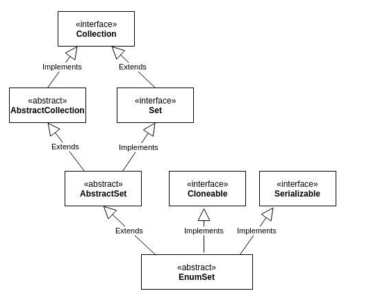
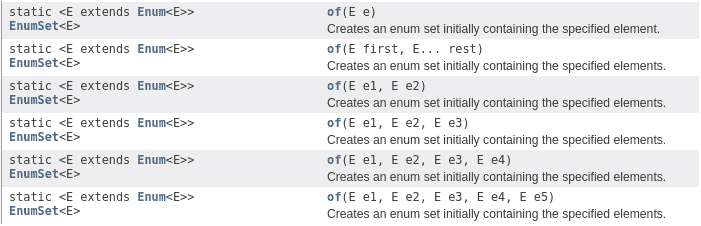

# Creating and Destroying Object

BU bölüm nesneleri creating ve destroying hakkındadır: ne zaman ve nasıl creating edilecekleri, ne zaman ve nasıl
creating'den kaçınılacağı, zamanında destroyed edilmelerinin nasıl sağlanacağı ve destruction'larından önce
gerçekleştirilmesi gereken temizleme eylemlerinin nasıl yönetileceği.

## Item 1: Consider static factory methods instead of constructors

## Item 1 : Constructor'lar yerine static factory method'ları göz önünde bulundurun.

Bir sınıfın bir client'in bir instance almasını sağlamasının traditional yolu, `public constructor` sağlamaktır. Her
programcının araç setinde bulunması gereken başka bir teknik daha var. Bir sınıf, sınıfın bir instance'i döndüren basit
bir `public static factory method` sağlayabilir. Boolean'dan (boolean için boxed primitive sınıf) basit bir örnek: Bu
method bir boolean primitive değerini bir Boolean object reference'ına çevirir:

```
public static Boolean valueOf(boolean b){
    return b ? Boolean.TRUE : Boolean.FALSE;
}
```

Static factory method'un, Design Patterns'taki Factory Method pattern'ı ile aynı olmadığına dikkat edin. Bu maddede
açıklanan static factory method'un Design Patterns'ta doğrudan bir karşılığı yoktur. Bir sınıf, client'larına public
constructor'lara ek olarak veya onların yerine static factory method'lar sağlayabilir. Bir public constructor yerine
static factory method sağlamanın hem avantajları hem de dezavantajları vardır.

Static factory method'ların bir avantajı, constructor'ların aksine adlarının olmasıdır. Bir constructor'ın
parametreleri, kendi başlarına döndürülen object'i tanımlamıyorsa, iyi seçilmiş bir ada sahip bir static factory
kullanmak daha kolaydır ve ortaya çıkan client code'u okumak daha basittir. Örneğin, büyük ihtimalle asal `(prime)` olan
bir `BigInteger` döndüren `BigInteger(int, int, Random)` constructor'ı, `BigInteger.probablePrime` adında bir static
factory method olarak daha iyi ifade edilebilirdi. Bir sınıf, belirli bir imzaya sahip yalnızca tek bir constructor'a
sahip olabilir. Programcıların bu kısıtlamayı, parametre listeleri yalnızca parametre tiplerinin sırasına göre farklılık
gösteren iki constructor sağlayarak aştığı bilinmektedir. Bu gerçekten kötü bir fikir. Böyle bir API'in kullanıcısı
hangi constructor'ın hangisi olduğunu asla hatırlayamayacak ve yanlışlıkla yanlış olanı çağıracaktır. Bu
constructor'ları kullanan kodu okuyan kişiler, sınıf dokümantasyonuna başvurmadan kodun ne yaptığını bilemeyeceklerdir.

Adları olduğu için, static factory method'lar önceki paragrafta bahsedilen kısıtlamayı paylaşmazlar. Bir sınıfın aynı
imzaya sahip birden fazla constructor gerektirdiği durumlarda, constructor'ları static factory method'larla ve
farklılıklarını vurgulamak için özenle seçilmiş adlarla değiştirin.

Static factory method'ların ikinci bir avantajı, constructor'ların aksine, her çağrıldıklarında yeni bir object
oluşturmak zorunda olmamalarıdır. Bu, immutable class'ların preconstructed instance'ları kullanmasına veya
construct edildikçe instance'ları cache'e almasına ve gereksiz duplicate object'lerin oluşturulmasını önlemek için
bunları tekrar tekrar dağıtmasına `(dispense)` olanak tanır. `Boolean.valueOf(boolean)` metodu bu tekniği gösterir: asla
yeni bir object oluşturmaz. Bu teknik `Flyweight pattern`'e benzer. Eşdeğer `(equivalent)` object’ler sıkça talep
ediliyorsa, özellikle oluşturulması maliyetliyse, performansı büyük ölçüde artırabilir.

Static factory method’ların tekrarlanan çağrılardan `(repeated invocations)` aynı object’i döndürebilme yeteneği,
sınıfların herhangi bir anda hangi instance’ların var olduğunu sıkı şekilde kontrol etmelerini sağlar. Bunu yapan
sınıflar `instance - controlled` olarak adlandırılır. `Instance - controlled` sınıflar yazmak için birkaç sebep vardır.
Instance control, bir sınıfın `singleton` veya örneklenemez `(noninstantiable)` olduğunu garanti etmesini sağlar.
Ayrıca, immutable bir value class’ın, iki eşit `(two equal)` instance'i bulunmadığını garanti etmesini sağlar:
`a.equals(b)` ancak ve ancak `a == b` ise geçerlidir. Bu, Flyweight pattern’in temelidir. Enum type'ları bu garantiyi
sağlar.

Statik factory metodlarının üçüncü bir avantajı, constructor'ların aksine, return type'larının herhangi bir
subtype'ndan bir object return edebilmeleridir. Bu, döndürülen object'in sınıfını seçme konusunda size büyük esneklik
sağlar.

Bu esnekliğin bir uygulaması, bir API'in sınıflarını public yapmadan object return edebilmesidir. Bu şekilde
implementasyon sınıflarını gizlemek, çok daha kompakt bir API’ye yol açar. Bu teknik, interface-based framework’lere
uygundur; burada interface'ler, static factory method’lar için doğal return type'ları sağlar.

Java 8’den önce, interface’lerin static method’ları olamazdı. Gelenek olarak, Type adındaki bir interface için static
factory method’lar, Types adında `noninstantiable` bir yardımcı sınıfa konurdu. Örneğin, Java Collections Framework,
interface’lerinin kırk beş utility implementasyonuna sahiptir; bunlar arasında `unmodifiable collection`'lar,
`synchronized collection`'lar ve benzerleri bulunur. Bu implementasyonların neredeyse tamamı, örneklenemez
`(noninstantiable)` bir sınıf olan `java.util.Collections` içindeki static factory method'lar aracılığıyla dışa
aktarılır. Döndürülen object'lerin class'ları ise tamamen `nonpublic`’tir.

Collections Framework API’si, her kolaylaştırıcı implementasyon (convenience implementation) için ayrı ayrı kırk beş
public class exported olacağından çok daha küçüktür. Yalnızca API'in boyutu değil, aynı zamanda kavramsal yük de
azalır: programcıların API'yi kullanabilmek için öğrenmesi gereken kavramların sayısı ve karmaşıklığı. Programcı,
returned object'in tam olarak interface'inde belirtilen API'ye sahip olduğunu bilir, bu nedenle implementation class'a
ait ek belgeleri okumaya gerek yoktur. Ayrıca, böyle bir static factory method kullanmak, client'ın returned object'e
implementation class yerine interface üzerinden referans vermesini gerektirir ki bu genellikle iyi bir pratiktir.

Java 8'den itibaren, interface'lerin static method içerememe kısıtlaması kaldırıldığı için, artık bir interface için
noninstantiable companion class sağlamak genellikle gereksizdir. Bu tür bir class'ta yer alabilecek birçok public static
member artık interface'in kendisine konulmalıdır. Ancak, bu static method'ların arkasındaki implementation kodunun büyük
kısmının ayrı bir `package-private class`'ta tutulması gerekebileceği unutulmamalıdır. Çünkü Java 8'de bir interface'in
tüm static member'ları public olmak zorundadır. Java 9 private static method'lara izin verse de, static field'lar ve
static member class'lar hala public olmak zorundadır.

Static factory'lerin dördüncü avantajı, döndürülen object'in class'ının, input parametrelerine bağlı olarak her call'da
değişebilmesidir. Döndürülen object'in class'ı, deklare edilen return type'ın herhangi bir subtype'ı olabilir. Ayrıca,
döndürülen object'in class'ı sürümden sürüme de değişebilir.

EnumSet class’ının hiçbir public constructor’ı yoktur, yalnızca static factory’leri vardır. OpenJDK implementasyonunda,
bu factory’ler, temel `(underlying)` enum type’ının boyutuna bağlı olarak iki subclass’tan birinin instance’ını
döner: Eğer enum type altmış dört veya daha az element’e sahipse — ki çoğu enum type böyledir — static factory’ler, tek
bir `long` ile desteklenen bir `RegularEnumSet` instance’ı döner. Eğer enum type altmış beş veya daha fazla element’e
sahipse, factory’ler bir `long[]` (long array) ile desteklenen bir `JumboEnumSet` instance’ı döner.

Bu iki implementation class’ının varlığı client’lar için görünmezdir. Eğer `RegularEnumSet` küçük enum type’ları için
artık bir performans avantajı sunmazsa, gelecekteki bir sürümde herhangi bir olumsuz etki olmadan kaldırılabilir. Benzer
şekilde, eğer performans açısından faydalı olacağı kanıtlanırsa, gelecekteki bir sürüm `EnumSet` için üçüncü veya
dördüncü bir implementation da ekleyebilir. Client’lar factory'den dönen object'in hangi class olduğu hakkında bilgi
sahibi değildir ve bunu umursamazlar; tek önem verdikleri, dönen nesnenin `EnumSet`’in bir subclass’ı olmasıdır.

> Enumset

https://www.baeldung.com/java-enumset

EnumSet, enum class’larla çalışmak için specialized bir Set collection’dır. Set interface’ini implement eder ve
`AbstractSet`’ten extend eder.



`AbstractSet` ve `AbstractCollection`, `Set` ve `Collection` interface’lerindeki neredeyse tüm method’lar için
implementation sağlasa da, `EnumSet` bunların çoğunu override eder.

EnumSet kullanmayı planladığımızda bazı önemli noktaları göz önünde bulundurmalıyız:

* Yalnızca enum value'larını içerebilir ve tüm value'ların aynı enum’a ait olması gerekir.

* Null değer eklemeye izin vermez; eklemeye çalışıldığında `NullPointerException` fırlatır.

* Thread-safe değildir, bu yüzden gerekiyorsa externally synchronize edilmelidir.

* Element’ler, enum’da declare edildikleri sıraya göre saklanır.

* Kopya üzerinde çalışan `fail-safe iterator` kullanır, bu nedenle collection üzerinde iteration yapılırken değişiklik
  olsa bile `ConcurrentModificationException` fırlatmaz.

### Neden EnumSet Kullanılır?

Genel bir kural olarak, enum value'ları saklanırken her zaman diğer Set implementation’ları yerine EnumSet tercih
edilmelidir. EnumSet, birden fazla static factory method içeren public abstract bir class’tır ve bu method’lar sayesinde
instance'lar oluşturabiliriz. JDK, package-private iki farklı implementation sağlar ve bunlar bir bit vector'u
tarafından desteklenir:

* RegularEnumSet - RegularEnumSet, bit vector'unu represent etmek için tek bir long kullanır. Long elementinin her biti
  enum value'larından birini represent eder. Enum’un `i-inci` değeri `i-inci` bitte saklanır, bu yüzden bir value'nun
  var olup olmadığını anlamak oldukça kolaydır. Long 64-bit bir data type olduğu için, bu implementation en fazla 64
  element saklayabilir.

* JumboEnumSet - Bir bit vector'u olarak long elementlerden oluşan bir `array` kullanır. Bu, bu implementation’ın 64’ten
  fazla element saklamasına olanak tanır. RegularEnumSet gibi çalışır, ancak value'nun saklandığı array indeksini bulmak
  için ek hesaplamalar yapar. Şaşırtıcı olmayan şekilde, array'in ilk long elementi enum’un ilk 64 değerini, ikinci
  elementi ise sonraki 64 değeri ve devamını saklar.

EnumSet factory method’ları, enum’un element sayısına bağlı olarak bir implementation veya diğerinin instance'larını
oluşturur:

```
if (universe.length <= 64)
    return new RegularEnumSet<>(elementType, universe);
else
    return new JumboEnumSet<>(elementType, universe);
```

Unutmayın ki, burada sadece enum class’ın büyüklüğü dikkate alınır, collection'da saklanacak element sayısı değil.

### EnumSet Kullanmanın Avantajları;

Yukarıda açıkladığımız EnumSet implementation’ı nedeniyle, EnumSet’teki tüm method’lar aritmetik bitwise operation’lar
kullanılarak implement edilmiştir. Bu hesaplamalar çok hızlıdır ve bu nedenle tüm basic operation'lar sabit zamanda
gerçekleştirilir.

EnumSet’i HashSet gibi diğer Set implementation’larıyla karşılaştırırsak, EnumSet genellikle daha hızlıdır çünkü
value'lar tahmin edilebilir `(predictable)` bir sırayla saklanır ve her computation için yalnızca bir bit incelenir.
HashSet’in aksine, doğru bucket’ı bulmak için hashcode hesaplamaya gerek yoktur.

Ayrıca, bit vector'lerin doğası gereği, EnumSet çok kompakt ve verimlidir. Bu yüzden daha az bellek kullanır ve bunun
getirdiği tüm avantajları sağlar.

### Main Operations;

EnumSet’in çoğu method’u, instance oluşturma method’ları hariç, diğer Set’ler gibi çalışır. Sonraki bölümlerde, tüm
yaratıcı `(creational)` method’ları detaylı olarak gösterecek ve diğer method’ları kısaca ele alacağız.

Örneklerimizde bir Color enum ile çalışacağız:

```
enum Color {
    RED, YELLOW, GREEN, BLUE, BLACK, WHITE
}
```

### Creational Methods;

EnumSet oluşturmanın en basit method’ları `allOf()` ve `noneOf()`’dur. Böylece Color enum’umuzdaki tüm elementleri
içeren bir EnumSet’i kolayca oluşturabiliriz:

```
EnumSet.allOf(Color.class);
```

Benzer şekilde, `noneOf()` method’unu kullanarak bunun tersini yapabilir ve boş bir `Color` collection'ı
oluşturabiliriz:

```
EnumSet.noneOf(Color.class);
```

Enum elementlerinin bir subset'i EnumSet oluşturmak istersek, overload edilmiş `of()` method’larını kullanabiliriz.
Sabit sayıda parametre alan (en fazla 5 farklı parametre) method’larla `varargs` kullanan method arasında ayrım yapmak
önemlidir:



Javadoc, varargs versiyonunun performansının, array'in oluşturulması nedeniyle diğerlerinden daha yavaş olabileceğini
belirtir. Bu yüzden, sadece başlangıçta 5’ten fazla element eklememiz gerektiğinde kullanılmalıdır.

Enum’un bir subset'ini oluşturmanın bir diğer yolu da `range()` method’unu kullanmaktır:

```
enum Color {
    RED, YELLOW, GREEN, BLUE, BLACK, WHITE
}

EnumSet<Color> range = EnumSet.range(Color.YELLOW, Color.BLACK);

System.out.println(range); // => [YELLOW, GREEN, BLUE, BLACK]
```

enum’da declare edilen sırayı takip ederler. Belirtildiği üzere, hem ilk hem de son element dahil edilir.

Başka faydalı bir factory method ise `complementOf()`’dur; bu method, parametre olarak verilen elementlerin
dışındakileri seçmemizi sağlar. Black ve White dışında tüm Color elementlerini içeren bir EnumSet oluşturalım:

```
EnumSet<Color> colors = EnumSet.complementOf(EnumSet.of(Color.BLACK, Color.WHITE));

System.out.println(colors); // => [RED, YELLOW, GREEN, BLUE]
```

Son olarak, başka bir EnumSet’teki tüm elementleri kopyalayarak bir EnumSet oluşturabiliriz:

```
EnumSet<Color> colors = EnumSet.copyOf(EnumSet.of(Color.BLACK, Color.WHITE));
        
System.out.println(colors); // => [BLACK, WHITE]
```

Internally, clone method’unu call eder.

Ayrıca, enum elementleri içeren herhangi bir Collection’dan da tüm elementleri kopyalayabiliriz. Bir listenin tüm
elementlerini kopyalamak için bunu kullanalım:

```
List<Color> colorsList = new ArrayList<>();
colorsList.add(Color.RED);

EnumSet<Color> colors = EnumSet.copyOf(colorsList);

System.out.println(colors); // => [RED]
``` 

### Other Operations;

Diğer işlemler, diğer Set implementation’larıyla tamamen aynı şekilde çalışır ve kullanımları arasında bir fark yoktur.
Bu yüzden, boş bir EnumSet oluşturup birkaç element eklemek kolaydır:

```
EnumSet<Color> colors = EnumSet.noneOf(Color.class);
colors.add(Color.RED);
colors.add(Color.YELLOW);

System.out.println(colors); // => [RED, YELLOW]
```

Ya da sadece elementleri kaldırmak için:

```
EnumSet<Color> colors = EnumSet.noneOf(Color.class);
colors.add(Color.RED);
colors.add(Color.YELLOW);
colors.remove(Color.RED);

System.out.println(colors); // => [YELLOW]
```

Belirli elementleri içeren bir EnumSet oluşturma;

```
EnumSet<Color> colors = EnumSet.of(Color.YELLOW, Color.BLACK, Color.WHITE);

System.out.println(colors); // => [YELLOW, BLACK, WHITE]
```

> Ending Magazine

Static factory’lerin beşinci avantajı, method’u içeren class yazıldığı anda, döndürülen object'in class’ının henüz var
olması gerekmediğidir. Bu tür esnek static factory method’ları, `Java Database Connectivity API (JDBC)` gibi service
provider framework’lerinin temelini oluşturur. Bir service provider framework, provider’ların bir service implement
ettiği ve sistemin bu implementation’ları client’lara sunduğu bir sistemdir; bu sayede client’lar implementation’lardan
ayrıştırılmış `(decoupling)` olur.

Bir service provider framework’ün üç temel component'i vardır:

1 - `Service interface` – bir implementation’ı represent eder.

2 - `Provider registration API` – provider’ların implementation’larını kaydetmek için kullandığı interface'dir.

3 - `Service access API` – client’ların service instance’larını elde etmek için kullandığı interface'dir.

Service access API, client’ların bir implementation seçmek için kriter belirtmesine izin verebilir. Böyle bir kriter
yoksa, API varsayılan bir implementation’ın instance’ını döner veya client’ın mevcut tüm implementation’lar arasında
dolaşmasına olanak sağlar. Service access API, service provider framework’ün temelini oluşturan esnek static
factory’dir.

Bir service provider framework’ün optional dördüncü component'i, service provider interface’dir; bu, service interface
instance'ları üreten factory object'ini tanımlar. Bir service provider interface olmadığında, implementasyonlar
reflektif olarak instantiate edilmek zorundadır. JDBC case'inde, Connection `service interface` rolünü oynar,
DriverManager.registerDriver `provider registration API`’ıdır, DriverManager.getConnection `service access API`’sıdır ve
Driver ise `service provider interface`’dir.

Service provider framework pattern’in birçok çeşidi vardır. Örneğin, service access API, provider’lar tarafından
sağlanan interface'den daha zengin bir service interface’i client’lara döndürebilir. Bu, Bridge pattern’idir. Dependency
injection framework’leri, güçlü service provider’lar olarak görülebilir. Java 6’dan itibaren platform, genel amaçlı
`(general purpose)` bir service provider framework olan `java.util.ServiceLoader`’ı içerir; bu yüzden kendi
framework’ünüzü yazmanız gerekmez ve genellikle yazmamanız önerilir. JDBC ise ServiceLoader’ı kullanmaz, çünkü JDBC daha
eski bir yapıdır.

> Service Provider Interface (SPI) in Java

`https://ricksmpark.medium.com/understanding-service-provider-interface-spi-in-java-8f04bfb72435`

Service Provider Interface (SPI), geliştiricilere uygulamalarını ihtiyaçlar değiştikçe esnek ve ölçeklenebilir hale
getirmek için değerli bir araç sunar. Bu rehber, SPI’yı yakından inceleyerek temel kavramlarını açıklar ve dinamik Java
uygulamaları oluşturmak için nasıl kullanılabileceğini gösterir. Haydi, SPI’yı keşfedip çok yönlü yazılım çözümleri
yaratma potansiyelini ortaya çıkaralım.

Temelde, `SPI (Service Provider Interface)` bir tasarım pattern’idir ve servis interface’lerini onların
implementasyonlarından ayırmayı `(decoupling)` kolaylaştırır. Üç temel component'den oluşur:

1 - `Service Provider Interface (SPI)` : Uygulama için sunulan service'leri tanımlayan interface’ler veya abstract
sınıflar kümesini ifade eder. `Servis provider`'ların uyması gereken structure ve functionality'i belirler.

2 - `Service Provider` : Provider olarak da bilinir; bir service'in somut `(concrete)` implementation'ıdır. Bir service
provider’ı tanımlamak için genellikle, service interface’in adıyla aynı olan bir konfigürasyon dosyasını
`META-INF/services` directory'sine yerleştirirsiniz. Bu dosya, service provider’ların tam sınıf adlarını `(fully
qualified class names)` belirtir. Service provider’lar, uygulamanın classpath’inde bulunabilir olmalıdır.

3 - `ServiceLoader` : Service implementation'larını gerektiğinde bulup yüklemek için kullanılan ana sınıftır. Daha önce
yüklenmiş service'lerin önbelleğini `(cache)` tutar. Call edildiğinde, önce önbellekte `(cache)` mevcut service'lerin
olup olmadığını kontrol eder ve service'leri önbelleğe `(cache)` alındıkları sırayla yükler. Daha fazla service
gerektiğinde, bu service'leri discover eder ve yükler; böylece resource'ların verimli kullanılması ve service'lerin
runtime'da bulunmasında esneklik sağlanır.

JDK 1.6’da, `java.util.spi` package'i SPI örnekleri sunar:

* `CurrencyNameProvider`, Currency sınıfı için localized para birimi sembolleri sunan provider'lar için service
  contract'ını tanımlayan soyut `(abstract)` bir sınıftır.

* `TimeZoneNameProvider`, TimeZone sınıfı için localized zaman dilimi isimleri sağlayan service provider'lar için
  soyut `(abstract)` bir sınıf olarak görev yapar.

Bir SPI implement ederken, bir service provider, tanımlanmış `(defined)` service type’ı implement eden veya extend eden
bir ya da daha fazla concrete class içerir. Tek bir SPI spesifikasyonunun birden fazla provider’ı barındırabileceğini
unutmamak önemlidir. Loose coupling’i teşvik etmek ve information hiding'i korumak için, provider class genellikle bir
proxy olarak görev yapar ve provider’ın belirli istekleri karşılayıp karşılayamayacağını belirlemek için yeterli
functionality içerir.

SPI’nin gücünü göstermek için, pluggable logging implementation'larına izin veren modüler bir logging framework
oluşturarak pratik bir gösterime başlayalım.

`Step 1 : Define the Service Interface`

Burada, framework’ümüzdeki logging functionality için bir contract olarak görev yapan Logger interface’ini tanımlarız.
Bu interface, tüm logging implementation'larının implement etmesi gereken tek bir log metodunu bildirir.

```
interface Logger{
    void log(String message);
}
```

`Step 2: Implement Service Providers`

Logger interface’inin concrete implementation’ları olan ConsoleLogger ve FileLogger oluşturulur. Her bir implementation,
mesajları loglama konusunda kendi logic'ini sağlar.

```
public class ConsoleLogger implements Logger {
    @Override
    public void log(String message) {
        System.out.println("[Console] " + message);
    }
}

public class FileLogger implements Logger {
    @Override
    public void log(String message) {
        try (FileWriter fileWriter = new FileWriter("output.txt", true)) {
            fileWriter.write("[File] " + message + "\n");
        } catch (IOException e) {
            throw new RuntimeException(e);
        }
    }
}
```

`Step 3: Registering Service Providers`

Eğer Maven ya da Gradle tarzı bir build tool kullanılmıyor ise IntelliJ'de root dizine `resources/META-INF/services`
isimli klasör manual olarak create edilir ve dizin `resource` olarak set edilir.

`META-INF/services/` dizininde `Logger adlı bir konfigürasyon dosyası oluştururuz. Bu dosya, service provider
implementation’larının fully qualified class name'lerini listeler:

`com.example.ConsoleLogger` ve `com.example.FileLogger`. Bu konfigürasyon, ServiceLoader’ın runtime’da service
provider’ları bulup yüklemesini sağlar.

Bizim örneğimizde;

```
META-INF/services/Logger
ConsoleLogger 
FileLogger
```

`Step 4: Dynamically Load Service Providers`

LoggerManager class’ında, Logger implementation’larını dynamic olarak yüklemek için ServiceLoader class’ını kullanırız.
ServiceLoader instance'ı üzerinde iteration yaparak Logger instance'ları elde eder ve bunları mesajları loglamak için
kullanırız.

```
public class LoggerManager {
    private static LoggerManager instance;
    private final ServiceLoader<Logger> serviceLoader;

    private LoggerManager() {
        serviceLoader = ServiceLoader.load(Logger.class);
    }

    public static synchronized LoggerManager of() {
        if (instance == null)
            instance = new LoggerManager();
        return instance;
    }

    public void log(String message) {
        try {
            for (Logger logger : serviceLoader) {
                logger.log(message);
            }
        } catch (ServiceConfigurationError serviceError) {
            serviceError.printStackTrace();
        }
    }
}
```

LoggerManager’ı singleton olarak implement ederek, uygulamanın lifecycle'ı boyunca serviceLoader’ın yalnızca bir
instance'ının olmasını sağlarsınız. Bu, gereksiz resource yüklemelerini önler ve resource'ların verimli kullanılmasını
destekler.

Derived;

```
LoggerManager.of().log("test");
```

Hem ConsoleLogger hemde FileLogger sorunsuzca çalışır.

> End Of Magazine

Yalnızca static factory method’lar sağlanmasının temel kısıtlaması, public veya protected constructor’a sahip olmayan
sınıfların subclass’larının oluşturulamamasıdır. Örneğin, Collections Framework’ündeki convenience implementation
class’larının hiçbirini subclass etmek mümkün değildir. Bu, gizli bir nimet olarak görülebilir; çünkü programcıları
`inheritance` yerine `composition` kullanmaya teşvik eder ve immutable type’lar için gereklidir.

Static factory method’ların ikinci bir dezavantajı, programcılar tarafından bulunmalarının zor olmasıdır.
Constructor’lar gibi API dokümantasyonunda göze çarpmazlar, bu yüzden constructor yerine static factory method sağlayan
bir class’ı nasıl instantiate edeceğini anlamak zor olabilir. Javadoc aracı bir gün static factory method’lara dikkat
çekebilir. O zamana kadar, class veya interface dokümantasyonunda static factory’lere dikkat çekerek ve yaygın
isimlendirme convention'larına uyarak bu problemi azaltabilirsiniz. İşte static factory method’lar için bazı yaygın
isimler. Bu liste kesinlikle tam kapsamlı değildir:

* `from` — Tek bir parametre alan ve bu type’ın karşılık gelen bir instance'ını döndüren bir type-conversion
  method’udur, örneğin:

```
Date d = Date.from(instant);
```

* `of` — Birden fazla parametre alan ve onları içeren bu type’ın bir instance'ını döndüren bir aggregation method’udur,
  örneğin:

```
Set<Rank> faceCards = EnumSet.of(JACK, QUEEN, KING);
```

* `valueOf` — `from` ve `of`’a göre daha açıklayıcı bir alternatiftir, örneğin:

```
BigInteger prime = BigInteger.valueOf(Integer.MAX_VALUE);
```

* `instance veya getInstance` — Parametreleri (varsa) tarafından tanımlanan, ancak aynı değere sahip olduğu söylenemeyen
  bir instance döndürür, örneğin:

```
StackWalker luke = StackWalker.getInstance(options);
```

* `create veya newInstance` — instance veya getInstance gibi, ancak her call'un yeni bir instance döndürmesini garanti
  eder, örneğin:

```
Object newArray = Array.newInstance(classObject, arrayLen);
```

* `getType` — getInstance gibi, ancak factory method başka bir class’ta ise kullanılır. Type, factory method’un
  döndürdüğü object'in tipidir, örneğin:

```
FileStore fs = Files.getFileStore(path);
```

* `newType` — newInstance gibi, ancak factory method başka bir class’ta ise kullanılır. Type, factory method’un
  döndürdüğü object'in tipidir, örneğin:

```
BufferedReader br = Files.newBufferedReader(path);
```

* `type` — getType ve newType’a kıyasla daha kısa bir alternatiftir, örneğin:

```
List<Complaint> litany = Collections.list(legacyLitany);
```

Özetle, static factory method’lar ve public constructor’ların her ikisinin de kullanımları vardır ve bunların göreceli
avantajlarını anlamak faydalıdır. Genellikle static factory’ler tercih edilir; bu yüzden static factory’leri
değerlendirmeden doğrudan public constructor sağlamaktan kaçının.