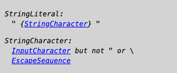
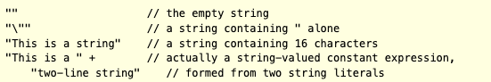
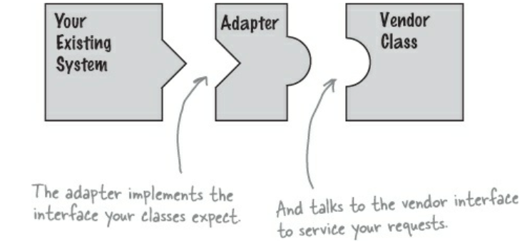
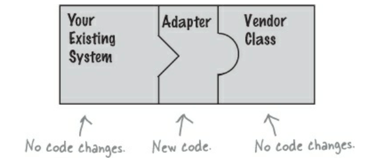
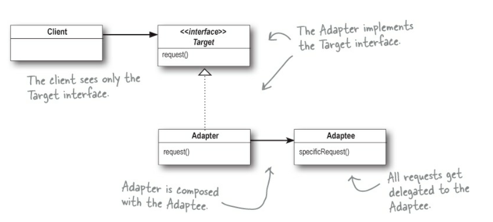

# Avoid creating unnecessary objects

# Gereksiz object’ler create etmekten kaçının.

Genellikle, her seferinde fonksiyonel olarak eşdeğer `(equivalent)` yeni bir object yaratmak yerine, tek bir object’i
yeniden kullanmak `(reuse)` daha uygundur. Reuse hem daha hızlı hem de daha şık olabilir. Bir object, immutable ise her
zaman yeniden kullanılabilir.

Yapılmaması gerekenlere extreme bir örnek olarak şu statement’ı düşünün:

```
String s = new String("bikini"); // DON'T DO THIS!
```

Bu statement, her çalıştırıldığında yeni bir String instance’ı oluşturur ve bu object creation'ların hiçbiri gerekli
değildir. String constructor’ının argümanı olan ("bikini") kendisi de bir String instance’ıdır ve constructor tarafından
oluşturulan tüm object’lerle fonksiyonel olarak aynıdır. Bu kullanım bir `loop` ya da sıkça invoke edilen bir method’da
gerçekleşiyorsa, gereksiz yere milyonlarca String instance’ı oluşturulabilir.

İyileştirilmiş versiyonu ise şu şekildedir:

```
String s = "bikini";
```

Bu versiyon, her çalıştırıldığında yeni bir tane oluşturmak yerine tek bir String instance kullanır. Ayrıca, aynı string
literal’i içeren ve aynı VM'de çalışan diğer kodlar tarafından da bu object’in yeniden kullanılacağı garanti edilir
`[JLS, 3.10.5]`

> String Literals

Bir string literal, çift tırnak `""` içine alınmış sıfır veya daha fazla character'dan oluşur. Character'lar escape
sequence'ler ile temsil edilebilir — `U+0000` ile `U+FFFF` aralığındaki character'lar için bir adet escape sequence,
`U+010000` ile `U+10FFFF` aralığındaki character'lar için ise `UTF-16 surrogate code unit`'lerine karşılık gelen iki
adet escape sequence kullanılır.



Bir string literal daima `String` type’indadır. Openin `"` karakterinden sonra ve closing'de ki eşleşen `(matching)` `"`
karakterinden önce bir satır sonlandırıcı `(line terminator)` bulunması compile time hatasıdır. Belirtildiği üzere,
karakterler `CR (Carriage Return)` ve `LF (Line Feed)` hiçbir zaman bir `InputCharacter` olarak kabul edilmez; her biri
bir `LineTerminator` (satır sonlandırıcı) olarak tanınır. Uzun bir string literal her zaman daha kısa parçalara
bölünebilir ve string concatenation operatörü `+` kullanılarak (gerekirse parantezli) bir ifade şeklinde yazılabilir.



Unicode escape’leri çok erken bir aşamada process edildiği için, sadece bir satırsonu karakteri `(LF)` içeren bir string
literal yazmak amacıyla `"\u000a"` yazmak doğru değildir; çünkü `\u000a` Unicode escape’i çeviri adımı 1’de gerçek bir
satırsonu karakterine dönüştürülür ve adım 2’de bu karakter bir `LineTerminator` haline gelir, bu nedenle adım 3’te
string literal artık geçerli değildir. Bunun yerine `"\n"` yazılmalıdır. Benzer şekilde, sadece bir satır başı
karakteri `(CR)` içeren bir string literal için `"\u000d"` yazmak da doğru değildir; onun yerine `"\r"` kullanılmalıdır.
Son olarak, bir çift tırnak (`"`) karakteri içeren bir string literal yazmak için `"\u0022"` kullanılamaz.

Bir string literal, `String` sınıfının bir instance'ına yapılan bir referanstır. Ayrıca, bir string literal her zaman
`String` sınıfının aynı instance’ına referans verir. Bunun nedeni, string literal’ların — ya da daha genel olarak,
constant expression’ların değeri olan string’lerin — `intern` edilmesidir; yani unique instance’ları paylaşmaları
amacıyla `String.intern` metodu kullanılarak bir pool'da saklanmalarıdır.

```
public static void main(String[] args) {
    String hello = "Hello", lo = "lo";
    System.out.println(hello == "Hello"); // => true
    System.out.println(Other.hello == hello); // => true
    System.out.println(hello == "Hel" + "lo"); // => true
    System.out.println(hello == "Hel" + lo); // => false
    System.out.println(hello == ("Hel" + lo).intern()); // => true
}

record Other() {
    static String hello = "Hello";
}
```

Bu örnek şu noktaları göstermektedir:

* Aynı class ve package içindeki string literal’lar, aynı `String` object’ine referans verirler.

* Aynı package farklı sınıflardaki string literal'lar, aynı String object'ine referans gösterir.

* Farklı package'de ki farklı sınıflardaki string literal'lar da aynı String object'ine referans gösterir.

* Constant expression'lardan concatenated string'ler compile time'da compute edilirler ve ardından sanki literal'lar
  gibi işlenir.

* Runtime'da concatenation ile compute edilen string'ler yeni oluşturulur ve bu nedenle farklıdırlar.

* Explicitly intern edilen computed bir string’in sonucu, aynı content'e sahip herhangi bir pre-existing string literal
  ile aynı String object'idir.

> End of explanation

Genellikle, hem constructor hem de static factory method sağlayan immutable class’larda, constructor yerine static
factory method kullanarak gereksiz object creating'den kaçınabilirsiniz. Örneğin, Java 9’da deprecated olan
`Boolean(String)` constructor’ı yerine `Boolean.valueOf(String)` factory method’u tercih edilir. Immutable object’lerin
yeniden kullanılmasına ek olarak, değiştirilmeyeceklerinden emin olduğunuz mutable object’leri de yeniden
kullanabilirsiniz.

Bazı object creation’ları diğerlerinden çok daha maliyetlidir. Böyle “pahalı object”lere tekrar tekrar ihtiyacınız
olacaksa, yeniden kullanım için bunları cache’lemek faydalı olabilir. Ne yazık ki, böyle bir object oluştururken her
zaman belirgin değildir. Bir string’in geçerli bir Roma rakamı olup olmadığını belirleyen bir method yazmak istediğinizi
varsayalım. İşte bunu regular expression kullanarak yapmanın en kolay yolu:

```
// Performans büyük ölçüde artırılabilir!
static boolean isRomanNumeral (String str){
    return str.matches("^(?=.)M*(C[MD]|D?C{0,3})"
            + "(X[CL]|L?X{0,3})(I[XV]|V?I{0,3})$");
}
```

Bu implementation'nın sorunu, `String.matches` method’una dayanmasıdır. `String.matches`, bir string’in regular
expression'a uyup uymadığını kontrol etmenin en kolay yolu olsa da, performans kritik durumlarda `repeated` kullanım
için uygun değildir. Sorun, `String.matches` method’unun internally olarak regular expression için bir Pattern
instance’ı oluşturması ve bunu yalnızca bir kez kullanmasıdır; ardından bu instance garbage collection tarafından
toplanmaya uygun hale gelir. Bir Pattern instance oluşturmak pahalıdır çünkü regular expression’ı finite state machine
compiling gerektirir.

Performansı artırmak için, regular expression’ı class initialization sırasında explicitly bir Pattern instance’ına (ki
bu immutable’dır) compile edin, cache’leyin ve `isRomanNumeral` method’unun her call'unda aynı instance’ı yeniden
kullanın:

```
// Reusing expensive object for improved performance
class RomanNumerals {
    private static final Pattern ROMAN = Pattern.compile(
            "^(?=.)M*(C[MD]|D?C{0,3})"
                    + "(X[CL]|L?X{0,3})(I[XV]|V?I{0,3})$");

    static boolean isRomanNumeral(String str){
        return ROMAN.matcher(str).matches();
    }
}
```

`isRomanNumeral` method’unun improved versiyonu, sıkça call edildiğinde önemli performans artışları sağlar. Benim
makinemde, orijinal versiyon 8 karakterlik bir input string için `1.1 µs` sürerken, improved versiyon `0.17 µs`
sürüyor; bu da 6.5 kat daha hızlıdır. Sadece performans artmakla kalmaz, aynı zamanda muhtemelen kodun anlaşılabilirliği
de artar. Aksi halde invisible olan Pattern instance’ı için static final bir field oluşturmak, ona bir isim vermemizi
sağlar; bu da regular expression’ın kendisinden çok daha okunabilir olur.

Improved `isRomanNumeral` method’unu içeren class initialize edildiğinde, ancak method hiç invoke edilmediğinde, `ROMAN`
field'i gereksiz yere initialize edilmiş olur. `ROMAN` field'inin initializing'ini, `isRomanNumeral` method’unun ilk
çağrıldığında lazy initialization ile engellemek mümkün olabilir, ancak bu önerilmez. Lazy initialization sıkça olduğu
gibi, bu case implementation'ı karmaşıklaştırır ancak ölçülebilir bir performans iyileştirmesi sağlamaz.

Bir object immutable olduğunda, safely yeniden kullanılabileceği açıktır, ancak başka durumlar vardır ki bunlar çok
daha az belli olur, hatta sezgiye aykırı olabilir. `Adapters`, diğer adıyla `views` case'ini düşünelim. Adapter, backing
bir object’e delegates yapan ve alternatif bir interface sağlayan bir object’tir. Adapter’ın, backing object’inden başka
bir state'i olmadığından, belirli bir object için birden fazla adapter instance’ı oluşturulmasına gerek yoktur.

> Adapter Design Pattern (HeadFirst Design Patterns Book)

Diyelim ki, mevcut bir yazılım sisteminiz var ve içine yeni bir tedarikçi `(vendor)` class library'si entegre etmeniz
gerekiyor, ancak yeni vendor interface'lerini önceki vendor'dan farklı tasarlamış:


Interface'leri, kodunuzu yazdığınız interface'ler ile uyuşmuyor. Bu şekilde çalışmaz. Tamam, mevcut kodunu değiştirerek
sorunu çözmek istemiyorsun (ve vendor'un kodunu da değiştiremezsin). Peki ne yaparsın? Yeni vendor interface'ini, senin
beklediğin interface'e `adapt` eden bir sınıf yazabilirsin.



Adapter, senin sınıflarının beklediği interface'i implement eder. Aynı zamanda, request'lerinize hizmet etmek için
vendor interface'i ile iletişim kurar. Adapter, client'dan gelen request'leri alır ve bunları vendor class'larının
anlayacağı request'ler haline dönüştürerek `middleman` görevini üstlenir.



Bir Duck interface'i düşünelim;

```
interface Duck{
    void quack();
    void fly();
}
```

Bu sefer, Duck'lar `quack` ve `fly` yapmalarını sağlayan bir Duck interface’ini implement ediyor. İşte Duck sınıfının
bir subclass'ı olan MallardDuck:

```
class MallardDuck implements Duck{
    @Override
    public void quack() {
        System.out.println("Quack");
    }

    @Override
    public void fly() {
        System.out.println("I am flying");
    }
}
```

Şimdi sırada mahalledeki en yeni kuşla tanışma zamanı:

```
interface Turkey{
    void gobble();
    void fly();
}
```

Turkeys quack yapmaz, onlar gobble yapar. Turkeys uçabilir, ancak sadece kısa mesafelerde uçabilirler.

```
class WildTurkey implements Turkey{
    @Override
    public void gobble() {
        System.out.println("Gobble");
    }

    @Override
    public void fly() {
        System.out.println("I am flying a short distance");
    }
}
```

Şimdi diyelim ki Duck object’leri az ve yerine bazı Turkey object’lerini kullanmak istiyorsun. Açıkçası, turkey'leri
doğrudan kullanamayız çünkü farklı bir interface’e sahipler. O halde, bir Adapter yazalım:

```
/* İlk olarak, adapting ettiğin type’ın interface’ini implement etmen gerekiyor. Bu, client’ının görmek istediği
interface’dir. */
class TurkeyAdapter implements Duck {
    Turkey turkey;

    /* Sonra, adapting ettiğimiz object'e referans almamız gerekiyor; burada bunu constructor aracılığıyla yapıyoruz.*/
    public TurkeyAdapter(Turkey turkey) {
        this.turkey = turkey;
    }

    @Override
    public void quack() {
        /* Şimdi interface’deki tüm method’ları implement etmemiz gerekiyor; quack() metodunun translation'ı kolay:
        sadece gobble() metodunu çağır. */
        turkey.gobble();
    }

    @Override
    public void fly() {
        /* Her iki interface de fly() metoduna sahip olmasına rağmen, Turkey’ler kısa aralıklarla uçarlar — Duck'lar
        gibi uzun mesafeler uçamazlar. Duck’ın fly() metodunu Turkey’in fly() metoduna eşlemek için, Turkey’in fly()
        metodunu beş kez çağırmamız gerekir. */
        for (int i = 0; i < 5; i++) {
            turkey.fly();
        }
    }
}
```

Şimdi adapter’ımızı test etmek için biraz koda ihtiyacımız var:

```
public static void main(String[] args) {
    Duck mallardDuck = new MallardDuck(); // Bir duck create edelim
    Turkey wildTurkey = new WildTurkey(); // Bir turkey create edelim

    /* Sonra turkey’i bir TurkeyAdapter ile wrap ediyoruz, böylece duck gibi görünmesini sağlıyoruz. */
    Duck turkeyAdapter = new TurkeyAdapter(wildTurkey);
    System.out.println("The turkey's says...");
    wildTurkey.gobble();
    wildTurkey.fly();

    System.out.println("\nThe ducks says...");
    testDuck(mallardDuck);

    // Şimdi büyük test: turkey’yi duck gibi göstermeye çalışıyoruz.
    System.out.println("\nTurkey adapter says...");
    testDuck(turkeyAdapter);
}

static void testDuck(Duck duck){
    duck.quack();
    duck.fly();
}
```

Output;

```
The turkey's says...
Gobble
I am flying a short distance

The ducks says...
Quack
I am flying

Turkey adapter says...
Gobble
I am flying a short distance
I am flying a short distance
I am flying a short distance
I am flying a short distance
I am flying a short distance
```

Ve adapter, `quack()` çağrıldığında gobble yapar, `fly()` çağrıldığında ise birkaç kez uçar. `testDuck()` metodu, içinde
`duck` kılığına girmiş bir `turkey` olduğunu asla fark etmez.

Adapter Pattern, bir sınıfın interface’ini client’ların beklediği başka bir interface’e dönüştürür. Adapter, uyumsuz
interface’lere sahip olduğu için birlikte çalışamayan sınıfların birlikte çalışmasını sağlar. Şimdi, bu pattern’in
uyumsuz interface’e sahip bir client’ı, dönüşümü `(conversion)` yapan bir Adapter yaratarak kullanmamıza izin verdiğini
biliyoruz. Bu, client’ı implement edilen interface’ten decouple eder ve interface’in zamanla değişmesini bekliyorsak,
adapter bu değişikliği encapsulate ederek client’ın her seferinde farklı bir interface ile çalışmak için
değiştirilmesini gereksiz kılar. Pattern’in runtime behavior'unu inceledik; şimdi de class diyagramına bakalım:



> End of explanation

Örneğin, Map interface’inin keySet method’u, Map object’inin tüm key'lerinden oluşan bir `Set view` döner. Safça
düşünüldüğünde, her `keySet` call'unun yeni bir Set instance’ı oluşturması gerektiği düşünülebilir, ancak belirli bir
Map object üzerindeki her `keySet` call'u aynı Set instance’ını döndürebilir. Geri dönen Set instance’ı tipik olarak
`mutable` olsa da, dönen tüm object’ler fonksiyonel olarak aynıdır: dönen object’lerden biri değiştiğinde, diğerleri de
değişir çünkü hepsi aynı Map instance’ına bağlıdır. `KeySet view object`’inin birden fazla instance’ını oluşturmak büyük
ölçüde zararsız olsa da gereksizdir ve herhangi bir faydası yoktur.

Gereksiz object oluşturmanın bir diğer yolu ise, programcının primitive ve boxed primitive türlerini mix etmesine izin
veren, gerektiğinde otomatik olarak boxing ve unboxing yapan `autoboxing`’dir. Autoboxing, primitive ve boxed primitive
type'ları arasındaki farkı bulanıklaştırır ama ortadan kaldırmaz. İnce anlamsal farklar ve belirgin performans
farklılıkları vardır. Aşağıdaki metodu düşünün; bu metot, tüm pozitif int değerlerin toplamını hesaplar. Bunu yapmak
için, programın long aritmetiği kullanması gerekir çünkü int, tüm pozitif int değerlerin toplamını tutmak için yeterince
büyük değildir:

```
// Berbat yavaş! Object creation’ını fark edebiliyor musun?
private static long sum() {
    Long sum = 0L;
    for (long i = 0; i < Integer.MAX_VALUE; i++) {
        sum += i;
    }
    return sum;
}
```

Bu program doğru sonucu veriyor, ancak olması gerekenden çok daha yavaş çalışıyor, çünkü tek karakterlik bir yazım
hatası var. `sum` değişkeni `long` yerine `Long` olarak declare edilmiştir, bu da programın yaklaşık 231 gereksiz Long
object'i oluşturması anlamına gelir (long i her Long sum’a eklendiğinde yaklaşık bir tane). `sum` değişkeninin
declaration'ı `Long`’dan `long`’a değiştirilmesi, benim makinemde çalışma süresini 6.3 saniyeden 0.59 saniyeye düşürür.
Ders açıktır: boxed primitive type'lar yerine primitive type'ları tercih edin ve istemeden oluşan `autoboxing`’e dikkat
edin.

```
long sum = 0L;
```

Bu madde, object creation'nın pahalı olduğu ve kaçınılması gerektiği anlamına gelmemelidir. Aksine, constructor'ları çok
az explicit iş yapan küçük object'lerin creation ve geri kazanılması `(reclamation)` ucuzdur, özellikle modern JVM
implementation'larında. Bir programın anlaşılırlığını, basitliğini veya gücünü artırmak için ek object'ler oluşturmak
genellikle iyi bir şeydir.

Tam tersine, object pool maintaining object creation'ı engellemek kötü bir fikirdir, pool'da ki object'ler heavyweight
değilse. Object pool'unu haklı çıkaran klasik örnek, bir database bağlantısıdır. Bağlantı kurulmasının maliyeti o kadar
yüksektir ki, bu object'leri yeniden kullanmak mantıklıdır. Genel olarak ise, kendi object pool'larınızı maintaining
kodunuzu karmaşıklaştırır, memory kullanımını artırır ve performansa zarar verir. Modern JVM implementation'ları,
lightweight object'ler için böyle object pool'larını rahatlıkla geride bırakan son derece optimize edilmiş garbage
collector'larına sahiptir.

Bu maddede belirtilene karşıt görüş, defensive copying konusundadır. Bu maddede, “Var olan bir object'i tekrar kullanmak
yerine yeni bir object yaratmamalısın” denirken, karşıt görüş olarak, “Yeni bir object yaratman gerektiğinde var olanı
tekrar kullanmamalısın” denir. Defensive copying gerektiğinde bir object'i tekrar kullanmanın cezası, gereksiz yere bir
kopya object yaratmanın cezasından çok daha büyüktür. Gerektiği yerlerde defensive copies oluşturmamak sinsi
`(insidious)` bug'lara ve güvenlik açıklarına yol açabilirken, gereksiz yere object oluşturmak yalnızca stil ve
performansı etkiler.