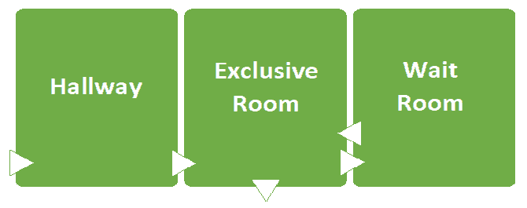
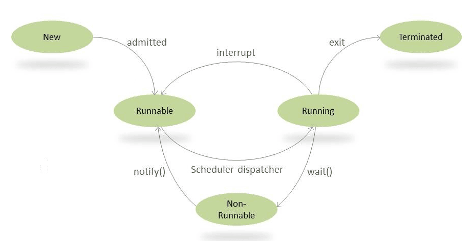

# Obey the general contract when overriding equals

# equals metodunu override ederken general contract'lara uyun.

`equals` metodunu override etmek basit gibi görünse de, yanlış yapmanın birçok yolu vardır ve sonuçları ciddi olabilir.
Sorunlardan kaçınmanın en kolay yolu `equals` metodunu override etmemektir; bu durumda sınıfın her instance'i sadece
kendisine `equal` olur. Aşağıdaki condition'ların herhangi biri geçerliyse, bu doğru olan yaklaşımdır:

* Sınıfın her bir instance'ı doğası gereği unique'dir. Bu durum, value'lardan ziyade active entities'leri represent eden
  Thread gibi sınıflar için geçerlidir. Object tarafından sağlanan `equals` implementation'ı, bu sınıflar için tam
  olarak doğru behavior'u sergiler.

* Sınıfın “logical equality” testi sağlamasına gerek yoktur. Örneğin, `java.util.regex.Pattern`, iki Pattern
  instance'ının tam olarak aynı regular expression'ı represent edip etmediğini kontrol etmek için `equals` metodunu
  override edebilirdi, ancak tasarımcılar, kullanıcıların bu functionality'e ihtiyaç duyacağını ya da isteyeceğini
  düşünmediler. Bu koşullar altında, Object sınıfından inherited equals implementation'ı idealdir.

* Bir superclass zaten `equals` metodunu override etmiş ve superclass'ın behavior'u bu sınıf için uygunsa. Örneğin, çoğu
  `Set` implementation'ı `equals` metodunu `AbstractSet`’ten, `List` implementation'ları `AbstractList`’ten ve `Map`
  implementation'ları `AbstractMap`’ten inherit alır.

* Sınıf `private` veya `package-private` ise ve `equals` metodunun asla invoke edilmeyeceğinden eminseniz. Eğer aşırı
  derecede riskten kaçınıyorsanız, `equals` metodunu yanlışlıkla invoke edilmemesini sağlamak için override
  edebilirsiniz:

```
@Override 
public boolean equals(Object o) {
    throw new AssertionError(); // Method is never called
}
```

Peki, equals metodunu ne zaman override etmek uygundur? Bir sınıfın, `mere object identity` farklı bir logical equality
kavramı varsa ve superclass zaten equals metodunu override etmemişse, equals metodunu override etmek uygundur.

`Mere object identity` - ifadesi, bir object'in sadece kendi kimliğiyle `(identity)`, yani bellekteki unique konumuyla
ilgili olmasını ifade eder. Bu, object'in content'inden, value'larından veya diğer object'ler ile olan ilişkilerinden
bağımsız olarak, sadece "bu object bu object'dir" bilgisini vurgular.

Bu case genellikle value class'ları için geçerlidir. Value class'ı, `Integer` veya `String` gibi bir value'yu represent
eden basit bir sınıftır. Bir programcı, `equals` metodunu kullanarak value object'lerinin referanslarını
karşılaştırdığında, aynı object'e point edip etmediklerini değil, logically olarak equivalent olup olmadıklarını
öğrenmeyi bekler. `Equals` metodunun override edilmesi sadece programcı beklentilerini karşılamak için gerekli olmakla
kalmaz, aynı zamanda object'lerin predictable ve istenen behavior ile map key'i veya set element'i olarak
kullanılabilmesini sağlar.

Equals metodunun override edilmesini gerektirmeyen bir tür value class, her value'ya karşılık en fazla bir object'in var
olmasını sağlayan `instance control` kullanan sınıftır. Enum type'ları bu kategoriye girer. Bu sınıflar için, logical
equality object identity ile aynıdır; bu nedenle Object sınıfının `equals` metodu logical equals metodu olarak işlev
görür.

`equals` metodunu override ettiğinizde, onun general contract'ına uymanız gerekir. İşte Object sınıfı için tanımlanan
contract:

`equals` metodu bir eşdeğerlik `(equivalence)` ilişkisi implement eder. Şu özelliklere sahiptir:

* `Reflexive` - Herhangi bir non-null referans değeri `x` için, `x.equals(x)` true döndürmelidir.

* `Symmetric` - Herhangi bir non-null `x` ve `y` referans value'ları için, `x.equals(y)` ancak ve ancak `y.equals(x)`
  true döndürüyorsa true döndürmelidir.

* `Transitive` - Herhangi bir non-null `x, y, z` referans value'ları için, eğer `x.equals(y)` true döndürüyorsa ve
  `y.equals(z)` true döndürüyorsa, o zaman `x.equals(z)` de true döndürmelidir.

* `Consistent` - Herhangi bir non-null `x` ve `y` referans value için, `x.equals(y)` metodunun birden fazla kez
  call edilmesi, eğer `equals` karşılaştırmasında kullanılan bilgiler değiştirilmediyse, tutarlı bir şekilde hep true ya
  da hep false döndürmelidir.

* Herhangi bir non-null referans value `x` için, `x.equals(null)` çağrısı false döndürmelidir.

Matematiksel olarak ilgili değilseniz, bu biraz korkutucu görünebilir ama bunu görmezden gelmeyin! Eğer buna uymazsanız,
programınızın düzensiz davrandığını veya çöktüğünü görebilirsiniz ve hatanın kaynağını bulmak çok zor olabilir. John
Donne’un dediği gibi, `hiçbir sınıf bir ada` değildir. Bir sınıfın instance'ları sık sık başka bir sınıfa pass edilir.
Tüm Collection sınıfları da dahil olmak üzere birçok sınıf, kendilerine pass edilen object'lerini equals contract'ına
uymasına bağlıdır.

> Value based classes - `https://www.baeldung.com/java-value-based-classes`

Value-based sınıflar Java 8’de tanıtılmıştır ve sonraki sürümlerde büyük ölçüde yeniden yapılandırılmış ve
geliştirilmiştir.

### Project Valhalla

Project Valhalla, Java’ya yeni özellikler ve yetenekler eklemek amacıyla OpenJDK tarafından yürütülen deneysel bir
projedir. Bu girişimin temel amacı, complete backward compatibility'i korurken `value` type'ları için geliştirilmiş
destek, generic specialization ve performans iyileştirmeleri eklemektir.

Value-based class'lar, Project Valhalla tarafından Java diline, traditional object-oriented class'ların getirdiği ek
yük `(overhead)` olmadan primitive, immutable value'ları kazandırmak amacıyla tanıtılan özelliklerden biridir.

### Primitives and Value-Types

Value-based class'ların formal definition'ınına gelmeden önce, Java'daki iki önemli semantic'e bakalım: primitive'ler ve
value type'lar.

Java'daki primitive data type'ları, ya da primitive'ler, tek bir value'yu represent eden simple data type'larıdır ve
object değildirler. Java, sekiz adet primitive data type'ı sağlar:

`byte, short, int, long, float, double, char, boolean`

Bunlar simple type'lar olsa da, Java bu type'lar ile object oriented bir şekilde etkileşim `(interact)` kurabilmemiz
için her biri için wrapper class'lar sağlar. Ayrıca, Java'nın object type ile primitive type arasında verimli bir
şekilde convert yapmak için `auto-boxing` ve `unboxing` işlemlerini otomatik olarak gerçekleştirdiğini hatırlamak
önemlidir:

```
List<Integer> list = new ArrayList<>();
list.add(1); // this is autoboxed
```

Primitive type'lar `stack` memory'de yaşarken, kodumuzda kullandığımız object'ler `heap` memory'de yaşar. Project
Valhalla, Java ekosisteminde object ile primitive arasında bir yerde duran yeni bir type tanıttı ve buna `value-type`
deniyor.

Value type’lar immutable type'lardır ve herhangi bir kimlikleri `(identity)` yoktur. Bu value type’lar aynı zamanda
inheritance'ı da desteklemezler. Value type’lar, tıpkı primitive type'lar gibi, referanslarıyla değil value'ları ile ele
alınırlar.

### Value-Based Classes

Value-based sınıflar, Java’da value type'ları gibi davranacak `(behave)` ve onları encapsulate edecek şekilde
tasarlanmış sınıflardır. JVM, `auto-boxing` ve `unboxing` gibi, value type'ları ile value based sınıfı arasında
serbestçe geçiş yapabilir. Value-based sınıflar da aynı nedenle kimlikten `(identity)` yoksundur.

### Properties of Value-Based Classes

Value-based sınıflar, simple immutable value'ları represent eden sınıflardır. Value-based bir sınıfın birkaç
properties'i vardır ve bunlar bazı genel temalar altında kategorize edilebilir.

1 - `Immutability` - Value-based sınıflar, int gibi primitive’lere benzer şekilde immutable data'ları represent etmek
üzere tasarlanmıştır ve aşağıdaki özelliklere sahiptir:

* Bir value-based sınıf her zaman `final`dir.

* Sadece `final` field'leri içerir.

* Sınıf, Object sınıfını veya instance field'lerini declare etmeyen abstract class'lar hiyerarşisini extend edebilir.

2 - `Object Creation` - value-based sınıfların yeni object'lerinin oluşturulmasının nasıl çalıştığını anlayalım:

* Sınıf, accessible herhangi bir constructor declare etmez.

* Eğer accessible constructor'lar varsa, kaldırılmaları için `deprecated` olarak işaretlenmelidirler.

* Sınıf yalnızca factory metotlar aracılığıyla instantiate edilmelidir. Factory’den alınan instance `new` bir instance
  olabilir veya olmayabilir ve calling kod onun kimliği `(identity) hakkında herhangi bir varsayımda bulunmamalıdır.

3 - `Identity and equals(), hashCode(), toString() Methods` - value-based sınıflar kimliksizdir `(identity)`. Java’da
hâlâ sınıf oldukları için, Object sınıfından inherited metotların nasıl çalıştığını anlamamız gerekiyor:

* `equals()`, `hashCode()` ve `toString()` metotlarının implementation'ları, yalnızca instance member'larının
  value'larına dayanır; object'in kimliğinden `(identity)` veya başka herhangi bir instance'in state'inden etkilenmez.

* İki object'in eşit `(equal)` olup olmadığı yalnızca object'lerin `equals()` metodu kontrolüne dayanır; reference based
  equality olan `==` operatörü ile değerlendirilmez.

* İki equal object'i birbirinin yerine kullanabiliriz ve bunlar herhangi bir computation veya metot invocation'da aynı
  result'ı üretmelidir.

4 - `Some Additional Caveats` - value-based sınıflarla çalışırken bazı ek sınırlamaları göz önünde bulundurmalıyız:

* `equals()` metoduna göre equal olan iki object, JVM içinde farklı object'ler veya aynı object olabilir.

* Monitörün özel `(exclusive)` sahipliğini `(ownership)` garanti edemeyiz, bu yüzden bu tür instance'lar synchronization
  için uygun değildir.

### Examples of Value-Based Classes

1 - `Value-Based Classes in the JDK` - JDK'da Value-based class spesifikasyonunu takip eden birkaç sınıf bulunmaktadır.
İlk tanıtıldıklarında, `java.util.Optional` ve `DateTime API (java.time.LocalDateTime)` value-based class'lardı. Java 16
ve sonrasında, `Integer` ve `Long` gibi tüm primitive type'ların wrapper sınıfları `value-based` class olarak
tanımlanmıştır.

Bu sınıflarda `jdk.internal` package'inden gelen `@ValueBased` annotation'ı bulunmaktadır:

```
@jdk.internal.ValueBased
public final class Integer extends Number implements Comparable<Integer>, Constable, ConstantDesc {
    // Integer class in the JDK
}
```

2 - `Custom Value-Based Class` - Yukarıda tanımlanan value-based class spesifikasyonuna uyan özel bir sınıf oluşturalım.
Örneğimiz için, 3B uzaydaki bir noktayı tanımlayan `Point` sınıfını ele alalım. Sınıfın üç adet integer field'i vardır:
`x, y, z`

Point definition'ının, belirli bir uzaydaki noktanın unique olması ve sadece value'su ile ifade edilebilmesi nedeniyle
`value-based` sınıf için iyi bir aday olduğunu söyleyebiliriz. Bu, `302` değerindeki bir integer gibi constant ve kesin
bir value'dur.

Sınıfı final olarak tanımlayarak ve properties'leri `x, y, z`’yi `final` yaparak başlayacağız. Ayrıca constructor
metodunu private yapalım. Sınıfın orijin noktası `(0, 0, 0)` önceden oluşturulmuş bir instance'i olsun ve
`x = 0, y = 0, z = 0` value'ları ile nokta oluşturulmak istendiğinde her seferinde aynı instance döndürülsün. Aynı
zamanda bir factory metodu şeklinde object oluşturma mekanizması sağlamamız gerekiyor:

```
final class Point {
    private static Point ORIGIN = new Point(0, 0, 0);

    private final int x;
    private final int y;
    private final int z;

    // private constructor
    private Point(int x, int y, int z) {
        this.x = x;
        this.y = y;
        this.z = z;
    }

    // factory method
    public static Point valueOfPoint(int x, int y, int z) {
        if (isOrigin(x, y, z)) return ORIGIN;
        return new Point(x, y, z);
    }

    // checking if a point is the origin
    private static boolean isOrigin(int x, int y, int z) {
        return x == 0 && y == 0 && z == 0;
    }
}
```

Factory metodu olan `valueOfPoint()`, parametrelere bağlı olarak yeni bir instance veya cache'e alınmış bir instance
döndürebilir. Bu durum, calling kodun object'in state'i hakkında herhangi bir varsayım yapmamasını veya iki instance'ın
referanslarını karşılaştırmamasını zorunlu kılar.

Son olarak, `equals()` metodunu yalnızca instance field'lerinin value'larına dayanarak define etmeliyiz:

```
@Override
public boolean equals(Object o) {
    if (!(o instanceof Point point)) return false;
    return x == point.x && y == point.y && z == point.z;
}

@Override
public int hashCode() {
    return Objects.hash(x, y, z);
}
```

Artık, `value-based` class gibi davranabilen `(behave)` bir Point sınıfımız var. Şimdi, uzaydaki `(1,2,3)` ile
gösterilen aynı noktanın iki instance'ının eşit olduğunu test edelim:

```
Point point1 = Point.valueOfPoint(1, 2, 3);
Point point2 = Point.valueOfPoint(1,2,3);
assertEquals(point1,point2);
```

Ayrıca, bu alıştırma için, iki origin `(0,0,0)` noktası oluşturulduğunda, referans ile karşılaştırıldıklarında aynı
olduklarını da görelim:

```
Point point1 = Point.valueOfPoint(0, 0, 0);
Point point2 = Point.valueOfPoint(0,0,0);
assertEquals(point1,point2);
```

### Advantages of Value-Based Classes

Artık value-based class’ların ne olduğunu ve nasıl define edileceğini bildiğimize göre, value-based class’lara neden
ihtiyaç duyabileceğimizi anlamaya çalışalım. Value-based class’lar Valhalla spesifikasyonunun bir parçası olarak hâlâ
deneysel aşamadadır ve gelişmeye devam etmektedir. Bu nedenle, bu tür class’ların sağladığı faydalar zamanla
değişebilir. Şu anda, value-based class’ların kullanımından elde edilen en önemli fayda memory kullanımıdır.

Value-based class’lar, reference based identity (kimlik) içermedikleri için daha fazla memory efficient'dir. Ek olarak,
JVM existing instance’ları reuse edebilir ya da gereksinimlere göre yenilerini oluşturabilir; böylece bellek kullanımını
azaltır. Ayrıca, synchronization gerektirmezler; bu da özellikle multithreaded uygulamalarda genel performansı artırır.

### Difference Between Value-Based Classes and Other Types

1 - `Immutable Classes` - Java’daki immutable sınıflar, value-based sınıflarla birçok ortak özelliği paylaşır. Bu
nedenle, aralarındaki farkları anlamak oldukça önemlidir. Value-based sınıflar yeni ve hâlen devam eden deneysel bir
özelliğin parçasıyken, immutable sınıflar uzun zamandır Java ekosisteminin temel ve ayrılmaz bir parçası olmuştur.
Java’daki `String` sınıfı, `Enum`’lar ve `Integer` gibi wrapper sınıflar, immutable sınıflara örnek olarak verilebilir.
Immutable sınıflar, value-based sınıflar gibi kimliksiz (identity-free) değildir. Aynı state'e sahip Immutable sınıf
instance'ları birbirinden farklıdır ve bu instance'ları reference equality ile karşılaştırabiliriz. Value-based class
instance’larında reference-based equality concept'i yoktur. Immutable class’lar accessible constructor’lar sağlayabilir
ve birden fazla attribute’a ve complex behavior'lara sahip olabilir. Ancak, value-based class’lar simple value’ları
represent eder ve birbirine bağlı `(dependent)` attribute’larla complex behavior'lar tanımlamaz. Son olarak
belirtmeliyiz ki, value-based class’lar definition gereği immutable’dır, ancak tam tersi doğru değildir.

2 - `Records` - Java, immutable data object'lerini kolayca taşımak için Java 14'te Records kavramını tanıttı. Records ve
value-based sınıflar, behavior ve semantic olarak benzer görünseler bile farklı amaçlara hizmet ederler. Records ile
value-based sınıflar arasındaki en belirgin fark, record’ların public constructor’lara sahip olması, value-based
sınıfların ise constructor’larının olmamasıdır.

> End of Magazine

> What Is a Monitor in Computer Science? `https://www.baeldung.com/cs/monitor`

Bir monitor, thread’lerin sahip olmasına izin veren bir senkronizasyon mekanizmasıdır:

* `mutual exclusion` – belirli bir zamanda yalnızca bir thread’in `locks` kullanarak metodu çalıştırabilmesi

* `cooperation` - thread’lerin belirli condition'ların sağlanmasını beklemesini sağlama yeteneği, `wait-set` kullanarak

Bu özelliğe neden “monitor” denir? Çünkü thread’lerin bazı resource'lara nasıl eriştiğini izler (monitor eder).

### Monitor Features

Monitorler, concurrent programlamaya üç temel özellik sağlar:

* sadece bir thread aynı anda kritik kod bloğuna `mutual exclusion` erişim sağlar

* Bir monitörde çalışan thread’ler, belirli condition'ların sağlanmasını beklerken bloke edilebilir.

* Bir thread, bekledikleri condition'lar sağlandığında diğer thread’leri bilgilendirebilir (notify edebilir).

### How Does Java Implement Monitors?

Kritik bölüm, farklı thread’lerin aynı data'lara eriştiği kod parçasıdır. Java’da, kritik bölümleri işaretlemek için
`synchronized` keyword'unu kullanırız. Bunu, metotları (aynı zamanda synchronized metotlar olarak da adlandırılır) veya
kodun daha küçük bölümlerini (synchronized bloklar) işaretlemek için kullanabiliriz. Basitçe söylemek gerekirse,
multithreaded bir ortamda, race condition, iki veya daha fazla thread'in aynı anda mutable shared data'yı güncellemeye
çalışması durumunda oluşur. Java, shared datalara thread'lerin erişimini synchronizing ederek race condition'larını
önlemek için bir mekanizma sunar. `synchronized` ile işaretlenen bir kod parçası, her seferinde yalnızca bir thread'in
çalışmasına izin veren synchronized bir blok haline gelir.

Multiple thread'in `calculate()` metodunu çalıştırdığı tipik bir race condition örneğini ele alalım:

```
public class PlayGround {
    public static void main(String[] args) throws Exception {
        try (ExecutorService executor = Executors.newFixedThreadPool(2)) {
            SynchronizedMethods summation = new SynchronizedMethods();
            IntStream.range(0,1000)
                    .forEach(count -> executor.submit(summation::calculate));
            executor.awaitTermination(1000, TimeUnit.MILLISECONDS);

            assertEquals(1000,summation.getSum());
        }
    }
}

class SynchronizedMethods {
    private int sum = 0;

    public void calculate() {
        setSum(getSum() + 1);
    }

    public int getSum() {
        return sum;
    }

    public void setSum(int sum) {
        this.sum = sum;
    }
}
```

Üç thread'li bir pool ExecutorService kullanarak `calculate()` metodunu 1000 kez çalıştırıyoruz. Eğer bunu serially
olarak çalıştırmış olsaydık, beklenen çıktı 1000 olurdu; ancak multi-threaded çalıştırmamız hemen hemen her seferinde
tutarsız ve hatalı bir çıktı veriyor:

Output (Sürekli değişkenlik gösterir);

```
Exception in thread "main" org.opentest4j.AssertionFailedError: expected: <1000> but was: <990>
```

Race condition sorununu önlemenin basit bir yolu, operation'ı thread-safe hale getirmek için `synchronized` keyword'unu
kullanmaktır.

`synchronized` keyword'unu farklı seviyelerde kullanabiliriz:

* Instance methods

* Static methods

* Code blocks

`synchronized` block kullandığımızda, Java internally olarak synchronization sağlamak için `MONITOR`, diğer adıyla
`MONITOR LOCK` veya `INTRINSIC LOCK` kullanır. Bu monitörler bir object'e bağlıdır `(bound)`; Bu nedenle, aynı object'in
tüm synchronized blokları aynı anda yalnızca bir thread tarafından execute edilebilir.

Metodu synchronized yapmak için metod bildirimine `synchronized` keyword'unu ekleyebiliriz:

```
public synchronized void calculate() {
    setSum(getSum() + 1);
}
```

Metodu synchronize ettiğimizde, `assertEquals(1000,summation.getSum());` durumunun gerçek çıktı olarak 1000 ile
geçtiğine dikkat edin.

Instance metodlar, metoda sahip sınıfın instance'ı üzerinde synchronized edilir; bu da sınıfın her instance'ı için
yalnızca bir thread'in bu metodu çalıştırabileceği anlamına gelir.

Static metodlar da instance metodlar gibi synchronized edilir:

```
public static synchronized void syncStaticCalculate() {
    staticSum = staticSum + 1;
}
```

Bu metodlar, sınıfla ilişkili Class object'i üzerinde synchronized edilir. Her sınıf için JVM başına yalnızca bir Class
object'i bulunduğundan, sahip olduğu instance sayısından bağımsız olarak, her sınıf için yalnızca bir thread static
synchronized metodun içinde çalışabilir.

Bazen tüm metodu değil, sadece içindeki bazı instruction'ları synchronize etmek isteriz. Bunu synchronized bloğu
uygulayarak yapabiliriz:

```
public void performSynchronisedTask() {
    synchronized (this) {
        setCount(getCount()+1);
    }
}
```

synchronized bloğa `this` parametresini geçirdiğimize dikkat edin. Bu, `MONITOR` object'idir. Block içindeki kod,
monitör object'i üzerinde synchronized edilir. Basitçe söylemek gerekirse, her monitör object'i için yalnızca bir thread
o kod bloğu içinde çalışabilir.

Eğer metod static olsaydı, object referansı yerine sınıf adını geçirirdik ve sınıf, block'un synchronization'ı için
monitör olurdu:

```
public static void performStaticSyncTask(){
    synchronized (SynchronisedBlocks.class) {
        setStaticCount(getStaticCount() + 1);
    }
}
```

### Reentrancy

synchronized metodlar ve blockların arkasındaki `lock`, `reentrant` (yeniden giriş yapabilen) bir `lock`'dır. Bu, mevcut
thread’in aynı synchronized `lock`'ı elinde tutarken tekrar tekrar alabileceği anlamına gelir:

```
Object lock = new Object();
synchronized (lock) {
    System.out.println("First time acquiring it");

    synchronized (lock) {
        System.out.println("Entering again");

         synchronized (lock) {
             System.out.println("And again");
         }
    }
}
```

Yukarıda gösterildiği gibi, synchronized block içinde aynı monitör `lock`'ını tekrar tekrar alabiliriz.

Hangi yaklaşımın tercih edileceği konusunda karşıt görüşler vardır. Metod synchronization genellikle daha basit olduğu
için önerilen yaklaşımdır, ancak synchronized statement'lar güvenlik açısından daha iyi bir tercih olabilir. Java’da
monitör ile her object veya sınıf arasında logical bir connection vardır. Bu nedenle, hem instance hem de static
metodları kapsarlar. Mutual exclusion her object ve sınıf ile ilişkili bir `lock` ile sağlanır. Bu `lock`, `mutex` adı
verilen binary bir semaphore'dur.

### Building and Exclusive Room Analogy

Java’nın monitör mekanizması iki kavrama dayanır. Bunlar `entry set` ve `wait set`’tir. Literatürde, yazarlar monitör
mekanizmasını represent etmek için `building` ve `exclusive room` benzetmesi kullanırlar. Bu benzetmede, exclusive bir
room'da aynı anda yalnızca bir kişi bulunabilir.

Yani, bu benzetmede:

* Monitör, içinde iki room ve bir hallway bulunan bir building'dir.

* synchronized resource, “exclusive room”dur.

* Wait set, “waiting room”dur.

* entry set “hallway”dir

* Thread’ler, exclusive room’a girmek isteyen kişilerdir.



Kişi exclusive room’a girmek istediğinde, önce bir scheduler beklediği hallway'e (entry set) gider. Bu nedenle,
scheduler kişiyi seçer ve onu exclusive room’a gönderir. JVM’lerdeki Scheduler'lar priority-based bir scheduling
algoritması kullanır. İki thread’in priority'si aynı olduğunda, JVM FIFO yaklaşımını kullanır.

Böylece, scheduler kişiyi seçtiğinde, kişi exclusive room’a girer. Bu room'da bazen özel bir durum olabilir, bu yüzden
kişi dışarı çıkıp exclusive room’un tekrar kullanılabilir hale gelmesini beklemek zorundadır. Bu nedenle, o kişi sonunda
waiting room’a `(wait set’e)` gider. Sonuç olarak, scheduler bu kişiyi daha sonra exclusive room’a girmesi için
schedule edecektir.

Ayrıca, thread’lerin bu süreçte geçtiği adımları aynı benzetmeyi kullanarak belirtmek önemlidir:

* Building'e giriş – monitöre giriş

* Exclusive room’a giriş – monitörü edinme

* Exclusive room’da bulunma – monitöre sahip olma

* Exclusive room’dan çıkma – monitörü serbest bırakma

* Building'den çıkma – monitörden çıkma.

Neyse ki, Java çoğu işi background'da yapar ve multithreaded uygulamalarla uğraşırken `semaphore` yazmamıza gerek
yoktur. Bu nedenle, yapmamız gereken tek şey kritik bölümü `synchronized` keyword'u ile wrap etmektir ve böylece bu
bölüm geçici olarak `(momentarily)` bir monitör region haline gelir.

### wait() and notify()

`wait()` ve `notify()`, thread’ler arasında iş birliği `(collaboration)` sağlayan ve synchronized bloklarda kullanılan
önemli metodlardır. `wait()`, calling thread’in monitörü release etmesini ve başka bir thread bu monitöre girip
`notify()` call edene kadar uykuya geçmesini sağlar. Ayrıca, `notify()` belirli object üzerinde `wait()` çağıran ilk
thread’i uyandırır.

Java’da birden fazla thread’in action'larını koordine etmek için kullanabileceğimiz araçlardan biri
`guarded block`’laradır. Bu blocklar, execution'a devam etmeden önce belirli bir condition'ı kontrol altında tutar.

Bunu göz önünde bulundurarak, aşağıdakileri kullanacağız:

* `Object.wait()` Thread’i askıya almak `(suspend)` için.

* `Object.notify()` Thread’i uyandırmak için `(wake up)`

Bunu, bir Thread’in lifecycle'ını gösteren aşağıdaki diyagramdan daha iyi anlayabiliriz:



* `The wait() Method` - Basitçe söylemek gerekirse, `wait()` calling mevcut thread’i, başka bir thread aynı object
  üzerinde `notify()` veya `notifyAll()` invoke edinceye kadar beklemeye zorlar. Bunun için current thread’in object'in
  monitörüne sahip olması gerekir. Javadoc’a göre, bu aşağıdaki şekillerde gerçekleşebilir:

1 - Belirtilen object için synchronized bir instance metod execute ettiğimizde

2 - Belirtilen object üzerinde synchronized bir bloğun body'sini execute ettiğimizde

3 - Class type'ında ki object'ler için synchronized static metodlar execute ederek

Bir object'in monitörüne aynı anda yalnızca bir active thread’in sahip olabileceğini unutmayın. wait() metodu üç adet
overloaded imzayla gelir. Bunlara bir göz atalım.

1 - `wait()` - başka bir thread bu object için notify() veya notifyAll() invoke edene kadar current thread’in süresiz
olarak beklemesine neden olur.

2 - `wait(long timeout)` - Bu metodu kullanarak, belirli bir timeout süresi belirtebilir ve bu sürenin sonunda thread
otomatik olarak uyandırılır. Bir thread, timeout'a ulaşmadan önce `notify()` veya `notifyAll()` kullanılarak
uyandırılabilir. `wait(0)` call'unun, `wait()` call'u ile aynı olduğunu unutmayın.

3 - `wait(long timeout, int nanos)` - Bu, aynı functionality'i sağlayan bir diğer imzadır. Buradaki tek fark, daha
yüksek hassasiyet belirtmemize olanak tanımasıdır. Toplam timeout süresi (nanosecond cinsinden)
`1_000_000 * timeout + nanos` olarak hesaplanır.

* `notify() and notifyAll()` - Object'in monitörüne erişim için bekleyen thread’leri uyandırmak için kullanırız.
  Bekleyen thread’leri uyandırmanın iki yolu vardır.

1 - `notify()` - Bu object'in monitöründe bekleyen tüm thread’lerden (`wait()` metodlarından herhangi birini kullanarak)
`notify()` metodu, herhangi birini rastgele uyandırır. Hangi thread’in uyandırılacağı kesin olarak belirlenemez ve
implementation'a bağlıdır. `notify()` tek bir rastgele thread’i uyandırdığı için, benzer task'ler yapan thread’lerin
karşılıklı mutual exclusion locking implement'i için kullanılabilir. Ancak çoğu case'de, `notifyAll()` kullanmak daha
uygun olacaktır.

2 - `notifyAll()` - Bu metod, bu object'in monitöründe bekleyen tüm thread’leri uyandırır. Uyandırılan thread’ler, bu
object üzerinde synchronize olmaya çalışan diğer thread’ler gibi normal şekilde yarışacaktır. Ancak, thread’in
execution'ınına devam etmesine izin vermeden önce, ilerlemek için gereken condition'ı hızlıca kontrol etmeyi her zaman
define edin. Bunun nedeni, bazı durumlarda thread’in notification almadan uyandırılmış olabileceği durumların
olmasıdır (bu senaryo daha sonra bir örnekte tartışılacaktır).

- Sender-Receiver Synchronization Problem : Temelleri anladığımıza göre, şimdi `wait()` ve `notify()` metodlarını
  kullanarak aralarında senkronizasyon sağlayacak basit bir Sender–Receiver uygulamasına bakalım:

Sender, receiver'a bir data package göndermekle sorumludur. Receiver, Sender data'yı göndermeyi bitirene kadar data
package'ini process edemez. Benzer şekilde, Sender, Receiver önceki package'i process etmeden yeni bir package
göndermeye çalışmamalıdır.

Öncelikle, Sender’dan Receiver’a gönderilecek data package'ini içeren bir `Data` sınıfı oluşturalım. Aralarındaki
senkronizasyonu kurmak için `wait()` ve `notifyAll()` metodlarını kullanacağız:

```
class Data {
    private String packet;

    // True if receiver should wait
    // False if sender should wait
    private boolean transfer = true;

    public synchronized String receive() {
        while (transfer) {
            try {
                wait();
            } catch (InterruptedException e) {
                Thread.currentThread().interrupt();
                System.err.println("Thread interrupted");
            }
        }
        transfer = true;
        String returnPacket = packet;
        notifyAll();
        return returnPacket;
    }

    public synchronized void send(String packet) {
        while (!transfer) {
            try {
                wait();
            } catch (InterruptedException e) {
                Thread.currentThread().interrupt();
                System.err.println("Thread interrupted");
            }
        }
        transfer = false;
        this.packet = packet;
        notifyAll();
    }
}
```

Burada neler olduğunu adım adım inceleyelim:

* `packet` variable'ı, network üzerinden transferred data'yı temsil eder.

* Sender ve Receiver synchronization için kullanacakları `transfer` adlı bir boolean variable'ımız var: Bu variable
  `true`  ise, Receiver Sender’in mesaj göndermesini beklemelidir. Eğer `false` ise, Sender Receiver'ın mesajı almasını
  beklemelidir.

* Sender, data'yı Receiver’a göndermek için `send()` metodunu kullanır: Eğer `transfer false` ise, bu thread üzerinde
  `wait()` calling ile bekleyeceğiz. Ancak `true` olduğunda, status'u değiştirir, mesajımızı ayarlar ve `notifyAll()`
  calling ile diğer thread’leri önemli bir event'in gerçekleştiğini bildirip execution'a devam edip edemeyeceklerini
  kontrol etmeleri için uyandırırız.

* Benzer şekilde, Receiver `receive()` metodunu kullanacaktır: Eğer `transfer`, Sender tarafından `false` olarak
  ayarlandıysa devam eder, aksi halde bu thread üzerinde `wait()` call edilir. Condition sağlandığında, status'u
  değiştirir, bekleyen tüm thread’leri uyandırmak için `notifyAll()` call eder ve alınan data package'ini döneriz.

- `wait()` metodunu neden while loop'u içinde wrap etmeliyiz? - `notify()` ve `notifyAll()`, bu object'in monitöründe
  bekleyen thread’leri rastgele uyandırdığından, condition'ın her zaman sağlanması garanti değildir. Bazen thread
  uyandırılır ancak condition henüz gerçekten sağlanmamıştır. Ayrıca, yanıltıcı `(spurious)` uyanmalardan `(wake ups)`
  korunmak için bir kontrol tanımlayabiliriz - bir thread, hiç notification almadan beklemeden uyanabilir (yanıltıcı
  uyanma).

- Send() ve Receive() metodlarını neden Synchronize etmemiz gerekiyor? - Bu metodları `intrinsic lock`'lar sağlamak için
  `synchronized` metodlar içinde tanımladık. `wait()` metodunu çağıran thread, `intrinsic lock`'a sahip değilse, bir
  error fırlatılır. Şimdi Sender ve Receiver sınıflarını oluşturup her ikisinde de Runnable interface'ini implement
  edeceğiz, böylece instance'ları bir thread tarafından çalıştırılabilir olacak.

Sender.class;

```
class Sender implements Runnable {
    private Data data;
    
    public Sender(Data data) {
        this.data = data;
    }

    @Override
    public void run() {
        String[] packets = {
                "First packet",
                "Second packet",
                "Third packet",
                "Fourth packet",
                "End"
        };

        for (var packet : packets) {
            data.send(packet);
            //Thread.sleep() to mimic heavy server-side processing
            try {
                Thread.sleep(ThreadLocalRandom.current().nextInt(1000, 5000));
            } catch (InterruptedException e) {
                Thread.currentThread().interrupt();
                System.err.println("Thread Interrupted");
            }
        }
    }
}
```

Şimdi bu Sender’a daha yakından bakalım:

Network üzerinden gönderilecek random data package'lerini `packets[]` array'i içinde oluşturuyoruz. Her package için
yalnızca `send()` metodunu call ediyoruz. Ardından, heavy server-side processing'i taklit `(mimic)` etmek için random
bir aralıkla `Thread.sleep()` call ediliyor.

Son olarak, Receiver’ımızı implement edelim:

```
class Receiver implements Runnable {
    private Data load;
    
    public Receiver(Data load) {
        this.load = load;
    }

    @Override
    public void run() {
        for (
                String receivedMessage = load.receive();
                !"End".equals(receivedMessage);
                receivedMessage = load.receive()
        ) {
            System.out.println(receivedMessage);
            //Thread.sleep() to mimic heavy server-side processing
            try {
                Thread.sleep(ThreadLocalRandom.current().nextInt(1000, 5000));
            } catch (InterruptedException e) {
                Thread.currentThread().interrupt();
                System.err.println("Thread Interrupted");
            }
        }
    }
}
```

Burada, “End” data package'ini alana kadar for loop'u içinde yalnızca `load.receive()` call ediyoruz.

Şimdi bu uygulamanın nasıl çalıştığını görelim:

```
public static void main(String[] args) {
    Data data = new Data();
    Thread sender = new Thread(new Sender(data));
    Thread receiver = new Thread(new Receiver(data));
    sender.start();
    receiver.start();
}
```

Output;

```
First packet
Second packet
Third packet
Fourth packet
```

Ve işte buradayız. Tüm data package'lerini doğru ve sıralı bir şekilde aldık ve sender ile receiver arasında doğru
iletişimi başarıyla kurduk. Bu yazıda, Java’daki bazı temel senkronizasyon kavramlarını ele aldık. Daha spesifik olarak,
wait() ve notify() metodlarını kullanarak ilgi çekici senkronizasyon problemlerini nasıl çözebileceğimize odaklandık.
Son olarak, bu kavramları pratikte uyguladığımız bir kod örneğini inceledik. Kapatmadan önce, wait(), notify() ve
notifyAll() gibi tüm bu low-level API’lerin traditional yöntemler olduğunu ve iyi çalıştığını belirtmekte fayda var;
ancak daha high-level mekanizmalar genellikle daha basit ve daha iyidir — örneğin Java’nın built-in `Lock` ve
`Condition` interface'leri (`java.util.concurrent.locks` package'inde bulunur).

> End of Magazine

Equals contract’ını ihlal etmenin tehlikelerinin farkında olduğunuza göre, şimdi bu contract’ı detaylıca inceleyelim.
İyi haber şu ki, göründüğünün aksine aslında çok complicated değildir. Bir kez anladıktan sonra, ona uymak zor değildir.

Peki, eşdeğerlik ilişkisi `(equivalence relation)` nedir? Kabaca söylemek gerekirse, bir set element'lerini birbirine
equal kabul edilen subset'lere bölen (partitions) bir operatör'dür. Bu subset'lere eşdeğerlik sınıfları `(equivalence 
classes)` denir. Bir equals metodunun faydalı olması için, her eşdeğerlik `(equivalence)` sınıfındaki tüm elementlerin
kullanıcı açısından birbirinin yerine geçebilir olması gerekir. Şimdi beş gereksinimi sırayla inceleyelim:

1 - `Reflexivity` - İlk gereksinim, bir object'in kendisiyle `equal` olması gerektiğini belirtir. Bunu istemeden ihlal
etmek zor olsa gerek. Eğer bunu ihlal edip sınıfınızın bir instance'ını bir Collection'a eklerseniz, `contains` metodu
Collection'ın eklediğiniz instance'ı içermediğini söyleyebilir.

2 - `Symmetry` - İkinci gereksinim, herhangi iki object'in birbirine equal olup olmadıkları konusunda aynı fikirde
olmalarını söyler. İlk gereksinimin aksine, bunu istemeden ihlal etmek kolaydır. Örneğin, büyük-küçük harf duyarsız bir
string implement eden aşağıdaki sınıfı düşünelim. String’in büyük-küçük harf case'i `toString` ile korunur ancak equals
karşılaştırmalarında `(comparisons)` dikkate alınmaz:

```
// Broken - violates symmetry!
final class CaseInsensitiveString {
    private final String str;

    public CaseInsensitiveString(String str) {
        this.str = Objects.requireNonNull(str);
    }

    // Broken - violates symmetry!
    @Override
    public boolean equals(Object o) {
        if (o instanceof CaseInsensitiveString) {
            return str.equalsIgnoreCase(((CaseInsensitiveString) o).str);
        } if (o instanceof String) // One-way interoperability!
            return str.equalsIgnoreCase((String) o);
        return false;
    }
    ... // Remainder omitted
}
```

Bu sınıftaki iyi niyetli `(well-intentioned)` equals metodu, sıradan stringlerle birlikte çalışmaya naif bir şekilde
çalışmaya çalışır. Bir tane büyük-küçük harf duyarsız string ve bir tane de sıradan `(ordinary)` stringimiz olduğunu
varsayalım:

```
CaseInsensitiveString cis = new CaseInsensitiveString("Polish");
String s = "polish";
```

Beklendiği gibi, `cis.equals(s)` true döner. Sorun şu ki, `CaseInsensitiveString` içindeki `equals` metodu sıradan
`(ordinary)` stringleri tanırken, String içindeki `equals` metodu büyük-küçük harf duyarsız stringlerden habersizdir.
Bu yüzden `s.equals(cis) false` döner, bu da Symmetry'nin açık bir ihlalidir. Diyelim ki bir büyük-küçük harf duyarsız
stringi bir Collection'a koydunuz:

```
CaseInsensitiveString cis = new CaseInsensitiveString("Polish");
String s = "polish";

List<CaseInsensitiveString> list = new ArrayList<>();
list.add(cis);
```

Bu durumda `list.contains(s)` ne döner? Kim bilir? Mevcut OpenJDK implementation'ının da `false` döner, ancak bu sadece
bir implementation detayıdır `(artifact)`. Başka bir implementation'da ise kolaylıkla `true` dönebilir veya runtime'da
exception fırlatabilir. Equals contract’ını ihlal ettiğinizde, diğer object'lerin sizin object'inizle karşılaştıklarında
nasıl davranacaklarını bilemezsiniz.

Sorunu ortadan kaldırmak için, equals metodundaki String ile birlikte çalışmaya yönelik yanlış tasarlanmış girişimi
kaldırmanız yeterlidir. Bunu yaptıktan sonra, metodu tek bir return statement'ına refactor edebilirsiniz:

```
@Override public boolean equals(Object o) {
    return o instanceof CaseInsensitiveString && ((CaseInsensitiveString) o).s.equalsIgnoreCase(s);
}
```

3 - `Transitivity` - Equals contract’ının üçüncü gereksinimi şunu söyler: Eğer bir object ikinciye equal ise ve ikinci
object üçüncüye equal ise, o zaman birinci object üçüncüye equal olmalıdır. Yine, bu gereksinimi istemeden ihlal etmek
zor değildir. Superclass'ına yeni bir value component ekleyen bir subclass'ın case'ini düşünelim. Başka bir deyişle,
subclass equals comparison'larını etkileyen yeni bir bilgi ekler. Basit bir immutable iki boyutlu integer point
sınıfıyla başlayalım:

```
class Point {
    private final int x;
    private final int y;

    public Point(int x, int y){
        this.x = x;
        this.y = y;
    }

    @Override
    public boolean equals(Object o) {
        if (!(o instanceof Point)) return false;
        Point point = (Point) o;
        return point.x == x && point.y == y;
    }

    @Override
    public int hashCode() {
        return Objects.hash(x, y);
    }
    
    ... // Remainder omitted
}
```

Bu sınıfı extend etmek ve bir Point'e Color kavramını eklemek istediğinizi varsayalım:

```
class ColorPoint extends Point{
    private final Color color;
    public ColorPoint(int x, int y, Color color){
        super(x,y);
        this.color = color;
    }
}
```

equals metodu nasıl görünmeli? Eğer equals metodunu tamamen yazmazsanız, Point sınıfından inherit alınan implementasyon
kullanılır ve color bilgisi equals comparison'larında göz ardı edilir. Bu, equals contract’ını ihlal etmese de, açıkça
kabul edilemez bir durumdur. Diyelim ki, yalnızca argümanı aynı position ve color'a sahip başka bir color point
olduğunda `true` dönen bir equals metodu yazdınız:

```
// Broken - violates symmetry!
@Override
public boolean equals(Object o){
    if (!(o instanceof ColorPoint))
        return false;
    return super.equals(o) && ((ColorPoint) o).color == color;
}
```

Bu metodun sorunu, bir `point` ile bir `color point`’i karşılaştırdığınızda ve tam tersi durumda farklı sonuçlar elde
edebilmenizdir. İlk karşılaştırma color'ı göz ardı ederken, ikinci karşılaştırma her zaman `false` döner çünkü argümanın
type'ı uygun değildir. Bunu concrete etmek için bir point ve bir color point oluşturalım:

```
Point p = new Point(1,2);
ColorPoint cp = new ColorPoint(1,2,Color.RED);

System.out.println(p.equals(cp)); // true
System.out.println(cp.equals(p)); // false
```

Sonuç olarak, `p.equals(cp)` true dönerken, `cp.equals(p)` false döner. Bu sorunu, ColorPoint.equals metodunun “mixed
comparison'larda” color'ı göz ardı etmesini sağlayarak çözmeyi deneyebilirsiniz:

```
// Broken - violates transitivity!
@Override
public boolean equals(Object o) {
    if (!(o instanceof Point)) return false;
    // Eğer "o" normal bir Point ise, rengi dikkate almayan bir comparison yap.
    if (!(o instanceof ColorPoint))
        return o.equals(this);
    // "o" bir ColorPoint ise, tam bir comparison yap.
    return super.equals(o) && ((ColorPoint) o).color == color;
}
```

Bu yaklaşım symmetry'i sağlar, ancak transitivity'den ödün verir:

```
ColorPoint p1 = new ColorPoint(1, 2, Color.RED);
Point p2 = new Point(1, 2);
ColorPoint p3 = new ColorPoint(1, 2, Color.BLUE);

System.out.println(p1.equals(p2)); // => true
System.out.println(p2.equals(p3)); // => true
System.out.println(p1.equals(p3)); // => false
```

Şimdi `p1.equals(p2)` ve `p2.equals(p3)` `true` dönerken, `p1.equals(p3)` `false döner — bu da transitivity'nin açık bir
ihlalidir. İlk iki comparison “color-blind” şekilde yapılırken, üçüncü comparison color'ı dikkate alır.

Ayrıca, bu yaklaşım `infinite recursion`'a neden olabilir: Diyelim ki Point sınıfının iki subclass'ı var: ColorPoint ve
SmellPoint — ve her biri bu type'da bir equals metoduna sahip. Bu durumda, `myColorPoint.equals(mySmellPoint)` call'u
bir `StackOverflowError` fırlatır. Peki çözüm nedir? Bu, object oriented dillerde equivalence ilişkilerinin temel bir
problemidir. `Instantiable` bir sınıfı extend edip ona yeni bir value component ekleyerek equals contract’ını korumanın
bir yolu yoktur — object-oriented abstraction'nın avantajlarından vazgeçmeye istekli olmadığınız sürece.

Equals metodunda `instanceof` testi yerine `getClass` testi kullanarak, instantiable bir sınıfı extend edip yeni bir
value component ekleyerek equals contract’ını koruyabileceğiniz söylenebilir:

```
// Broken - violates Liskov substitution principle
@Override
public boolean equals(Object o) {
    if (o == null || o.getClass() != getClass())
        return false;
    Point p = (Point) o;
    return p.x == x && p.y == y;
}
```

Bu yöntem, object'lerin yalnızca aynı implementation sınıfına sahip olduklarında equating sayılmasını sağlar. Bu ilk
bakışta kötü görünmeyebilir, ancak sonuçları kabul edilemezdir: Point’in bir subclass'ının instance'ı hâlâ bir Point’tir
ve bir Point gibi davranması gerekir, ancak bu yaklaşımı benimserseniz bunu başaramaz! Diyelim ki bir point'in unit
circle üzerinde olup olmadığını söyleyen bir metod yazmak istiyoruz.

Bunu yapabileceğimiz bir yol şudur:

```
// Initialize unitCircle to contain all Points on the unit circle
private static final Set<Point> unitCircle = Set.of(
        new Point(1, 0),
        new Point(0, 1),
        new Point(-1, 0),
        new Point(0, -1)
);

public static boolean onUnitCircle(Point p){
    return unitCircle.contains(p);
}
```

Bu, functionality'i implement etmenin en hızlı yolu olmayabilir ancak gayet iyi çalışır. Diyelim ki Point’i value
component eklemeden basitçe extend ettiniz; örneğin, constructor'ının oluşturulan instance sayısını tutmasını
sağlayarak:

```
class CounterPoint extends Point {
    private static final AtomicInteger counter = new AtomicInteger();

    public CounterPoint(int x, int y) {
        super(x, y);
        counter.incrementAndGet();
    }

    public static int numberCreated() {
        return counter.get();
    }
}
```

Liskov substitution principle, bir type'ın önemli herhangi bir property'sinin tüm subtype'ları için de geçerli olması
gerektiğini söyler; böylece type için yazılan herhangi bir metod, subtype'larda da aynı şekilde çalışmalıdır. Bu, daha
önceki iddiamızın resmi ifadesidir: Point’in bir subclass'ı (örneğin CounterPoint) hâlâ bir Point’tir ve bir Point gibi
davranmalıdır. Ama diyelim ki bir `CounterPoint` object'ini `onUnitCircle` metoduna verdik.

```
public static boolean onUnitCircle(Point p) {
    return unitCircle.contains(p);
}
```

Eğer `Point` sınıfı `getClass` based bir `equals` metodu kullanıyorsa, `onUnitCircle` metodu `CounterPoint`
instance'ının `x` ve `y` koordinatlarına bakmaksızın `false` dönecektir. Bunun nedeni, `onUnitCircle` metodunda
kullanılan `HashSet` dahil olmak üzere çoğu collection’ın, içerik `(contaiment)` kontrolü için `equals` metodunu
kullanmasıdır ve hiçbir `CounterPoint` instance'i herhangi bir `Point`’e equal değildir. Ancak, Point sınıfında düzgün
bir şekilde `instanceof` based bir equals metodu kullanırsanız, aynı `onUnitCircle` metodu bir `CounterPoint` instance'i
ile de sorunsuz çalışır.

Instantiable bir sınıfı extend edip bir value component'i eklemenin tatmin edici bir yolu olmasa da, bunun için gayet
iyi bir alternatif çözüm vardır: “Inheritance yerine composition tercih edin.”. ColorPoint’in Point sınıfını extend
etmesi yerine, ColorPoint’e private bir Point field'i verin ve bu color point ile aynı position'da olan point’i döndüren
bir `public view` metodu sağlayın:

```
// Equals contract’ını ihlal etmeden bir value componenti ekler.
class ColorPoint {
    private final Point point;
    private final Color color;

    public ColorPoint(int x, int y, Color color) {
        point = new Point(x, y);
        this.color = Objects.requireNonNull(color);
    }

    // Bu color point’in point view'ini döner.
    public Point asPoint(){
        return point;
    }

    @Override
    public boolean equals(Object o) {
        if (!(o instanceof ColorPoint)) return false;
        ColorPoint cp = (ColorPoint) o;
        return cp.point.equals(point) && cp.color.equals(color);
    }

    @Override
    public int hashCode() {
        return Objects.hash(point, color);
    }
}
```

Java platform library'lerinde, instantiable bir sınıfı extend edip bir value component ekleyen bazı sınıflar vardır.
Örneğin, `java.sql.Timestamp` sınıfı, `java.util.Date` sınıfını extend eder ve bir `nanoseconds` field'i ekler.
Timestamp sınıfının `equals` implementasyonu symmetry'i ihlal eder ve Timestamp ile Date object'leri aynı Collection'da
kullanıldığında veya birlikte işlendiğinde tutarsız davranışlara neden olabilir. Timestamp sınıfı, programcıları date
ve time stamp'lerini karıştırmamaları konusunda uyaran bir uyarı içerir. Onları ayrı tuttuğunuz sürece sorun
yaşamazsınız, ancak onları karıştırmanızı engelleyen bir şey yoktur ve ortaya çıkan hataların debugging'i zor olabilir.
Timestamp sınıfının bu behavior'u bir hataydı ve taklit edilmemelidir.

Abstract bir sınıfın subclass'ına equals contract’ını ihlal etmeden bir value component'i ekleyebileceğinizi unutmayın.
“Tagged class'lar yerine sınıf hiyerarşilerini tercih edin.” tavsiyesini izleyerek oluşturduğunuz sınıf hiyerarşileri
için önemlidir. Örneğin, value component'i olmayan abstract bir Shape sınıfınız, radius field'i ekleyen bir subclass
`Circle` ve `length` ile `width` field'leri ekleyen bir subclass `Rectangle` olabilir. Superclass instance'ının directly
oluşturulması mümkün olmadığı sürece, daha önce gösterilen türden problemler ortaya çıkmaz.

4 - `Consistency` - Equals contract’ının dördüncü gereksinimi şunu söyler: Eğer iki object equal ise, bunlardan biri
(veya her ikisi) değiştirilmedikçe her zaman equal kalmalıdırlar. Başka bir deyişle, mutable object'ler farklı
zamanlarda farklı object'lere equal olabilirken, immutable object'ler böyle olamaz. Bir sınıf yazarken, onun immutable
olup olmaması gerektiği hakkında iyi düşünün. Eğer böyle olması gerektiği sonucuna varırsanız, `equals` metodunuzun
şu kısıtlamayı uyguladığından emin olun: equal object'lerin her zaman equal kalması ve `unequal` object'lerin her zaman
`unequal` kalması.

Bir sınıfın immutable olup olmadığına bakılmaksızın, güvenilir olmayan resource'lara bağlı bir `equals` metodu yazmayın.
Bu yasağa uymazsanız, tutarlılık `(consistency)` gereksinimini karşılamak son derece zor olur. Örneğin, `java.net.URL`
equals metodu, URL’lere bağlı host'ların IP adreslerinin comparison'ununa dayanır. Bir host name'i IP adresine
translating için network access gerektirebilir ve zaman içinde aynı sonuçları vermesi garanti değildir. Bu durum, URL
equals metodunun equals contract’ını ihlal etmesine neden olabilir ve pratikte sorunlar yaratmıştır. URL’in equals
metodunun bu behavior'u büyük bir hataydı ve taklit edilmemelidir. Ne yazık ki, uyumluluk gereksinimleri nedeniyle bu
değiştirilemez. Bu tür sorunları önlemek için, `equals` metodları yalnızca memory'de bulunan object'ler üzerinde
`deterministik` computation'lar yapmalıdır.

5 - `Non-nullity` - Son gereksinimin resmi bir adı yoktur, bu yüzden ben ona “non-nullity” adını verdim. Bu, tüm
object'lerin null ile eşit olmaması `(unequal)` gerektiğini belirtir. `o.equals(null)` çağrısına `(invocation)`
yanlışlıkla `true` dönmek zor olsa da, yanlışlıkla `NullPointerException` fırlatmak kolaydır. General contract bunu
yasaklar. Birçok sınıf, `null` için explicit bir testle bunu engelleyen `equals` metodlarına sahiptir:

```
@Override 
public boolean equals(Object o) {
    if (o == null)
    return false;
    ...
}
```

Bu test gereksizdir. Argümanını equality açısından test etmek için, equals metodu önce argümanını uygun bir type'a
cast etmeli ki accessor'ler invoke edebilsin veya field'lerine erişilebilsin. Cast işlemi yapmadan önce, metod
argümanının doğru type'a sahip olduğunu kontrol etmek için `instanceof` operatörünü kullanmalıdır:

```
@Override 
public boolean equals(Object o) {
    if (!(o instanceof MyType))
        return false;
    MyType mt = (MyType) o;
    ...
}
```

Eğer bu type check eksik olsaydı ve equals metodu wrong type bir argüman alsaydı, equals metodu bir `ClassCastException`
fırlatırdı ve bu da equals contract'ını ihlal ederdi. Ancak `instanceof` operatörünün, ilk operandı null ise, ikinci
operandta hangi type olursa olsun `false` döneceği belirtilmiştir `[JLS, 15.20.2]`

> `[JLS, 15.20.2]` Type Comparison Operator instanceof

`instanceof` operatörünün `RelationalExpression` operandının type'ı reference type'ı veya null type'ı olmalıdır; aksi
takdirde compile time error oluşur. `instanceof` operatöründen sonra belirtilen ReferenceType, `reifiable`
(gerçeklenebilir) bir reference type'ını belirtmiyorsa, bu compile time hatasıdır. Eğer RelationalExpression'ın
ReferenceType'a cast edilmesi compile time hatası olarak reject edilecekse, `instanceof relational expression` da aynı
şekilde compile time error'u üretir. Böyle bir durumda, `instanceof` expression'ının sonucu asla `true` olamaz.
Runtime'da, `RelationalExpression` value'sunun `null` olmaması ve referansın `ClassCastException` fırlatmadan
ReferenceType’a cast edilebilmesi durumunda `instanceof` operatörünün sonucu `true` olur. Aksi takdirde sonuç
`false`’dur.

```
public class PlayGround {
    public static void main(String[] args) {
        Point p = new Point();
        Element e = new Element();

        if (e instanceof Point){ // compile-time error
            System.out.println("I get your point!");
            p = (Point)e;  // compile-time error
        }
    }
}

class Point{
    int x, y;
}

class Element{
    int atomicNumber;
}
```

Bu program iki compile time error'u ile sonuçlanır. (Point)'e cast yanlıştır çünkü Element’in veya olası
subclass'larının (burada hiçbiri gösterilmemiştir) hiçbir instance'i Point’in herhangi bir subclass'ının instance'ı
olamaz. instanceof expression'ı tam olarak aynı nedenle yanlıştır. Öte yandan, `Point` sınıfı `Element`’in bir
subclass'ı olsaydı (bu örnekte garip bir durum olmakla birlikte):

```
class Point extends Element { 
    int x, y; 
}
```

o zaman cast mümkün olurdu, ancak bu bir runtime check gerektirir ve `instanceof` expression'ı anlamlı ve geçerli
olurdu. (Point)e cast asla bir exception fırlatmazdı çünkü `e`’nin value'su doğru şekilde Point type'ına cast
edilemezse, cast gerçekleştirilmezdi.

> End of document

Bu nedenle, type check `null` verilirse `false` döner, dolayısıyla explicit bir `null` kontrolüne gerek yoktur. Hepsini
bir araya getirerek, işte yüksek kaliteli bir equals metodunun tarifi:

1 - Argument'in bu object'e reference olup olmadığını kontrol etmek için `==` operatörünü kullanın. Eğer öyleyse, `true`
döndürün. Bu sadece bir performans optimizasyonudur ancak comparison potansiyel olarak maliyetliyse yapılmaya değerdir.

2 - Argument'in doğru type'a sahip olup olmadığını kontrol etmek için `instanceof` operatörünü kullanın. Değilse, false
döndürün. Genellikle, doğru `(correct)` type metotun bulunduğu sınıftır. Bazen ise, bu sınıf tarafından implement edilen
bir interface'dir. Sınıf, equals contract'ını iyileştirerek interface'i implement eden sınıflar arasında comparison'lara
izin veren bir interface'i implement ediyorsa, bu durumda bir interface kullanın. `Set, List, Map` ve `Map.Entry` gibi
Collection interface'leri bu özelliğe sahiptir.

3 - Argument'i doğru type'a cast edin. Bu cast'den önce `instanceof` testi yapıldığından, casting'in başarılı olması
garanti edilir.

4 - Sınıftaki her “anlamlı `(significant)`” field için, argümandaki o field’ın bu object'de ki karşılık gelen field ile
match olup olmadığını kontrol edin. Bu testlerin hepsi başarılı olursa, `true` döndürün; aksi takdirde, `false`
döndürün. 2. Step'de ki type bir interface ise, argümanın field’larına interface metotları aracılığıyla erişmelisiniz;
Type bir sınıf ise, erişilebilirliklerine `(accessibility)` bağlı olarak field’lara directly erişebilirsiniz.

Type'ı `float` veya `double` olmayan primitive field’lar için comparison'lar da `==` operatörünü kullanın; Object
reference field’ları için, equals metodunu recursively olarak call edin; float field’lar için,
`static Float.compare(float, float)` metodunu kullanın; double field’lar için, `Double.compare(double, double)` metodunu
kullanın. `float` ve `double` field’ların özel olarak işlenmesi, `Float.NaN`, `-0.0f` ve benzer double value'larının
varlığı nedeniyle gereklidir; Ayrıntılar için `JLS 15.21.1` veya `Float.equals` dokümantasyonuna bakınız.

> JLS 15.21.1 Numerical Equality Operators == and !=

Equality operatörünün her iki operandı da numeric type'da ise veya biri numeric type'da olup diğeri numeric type'a
dönüştürülebiliyorsa, operandlar üzerinde `binary numeric promotion` yapılır. Binary numeric promotion value set
conversion gerçekleştirir ve `unboxing` conversion da yapabilir. Operandların promoted type'ı int veya long ise, integer
equality testi yapılır. Promoted type `float` veya `double` ise, floating-point equality testi yapılır. Floating-point
value'lar üzerinde comparison, represent ettikleri value set'lerinden bağımsız olarak doğru şekilde yapılır.
Floating-point equality testi, `IEEE 754` standardının kurallarına uygun olarak gerçekleştirilir:

Operandlardan biri `NaN` ise, `==` işleminin sonucu `false` olur ancak `!=` işleminin sonucu true olur. Gerçekten de,
`x!=x` testi ancak ve ancak `x`’in değeri `NaN` ise `true` olur. Bir değerin `NaN` olup olmadığını test etmek için
`Float.isNaN` ve `Double.isNaN` metodları da kullanılabilir.

Pozitif sıfır ve negatif sıfır `equal` olarak kabul edilir. Örneğin, `-0.0==0.0 is true`.

Aksi takdirde, iki farklı floating-point value'su equality operatörleri tarafından `unequal` olarak kabul edilir.

Özellikle, positive infinity represent eden bir value ve negative infinity'i represent eden bir value vardır; her biri
yalnızca kendisiyle equal olarak compare edilir ve diğer tüm value'lar ile `unequal` olarak compare edilir.

Floating-point numberlar için bu hususlar göz önünde bulundurulduğunda, `NaN` dışındaki `integer` operandlar veya
floating-point operandlar için aşağıdaki kurallar geçerlidir:

* `==` operatörünün produce ettiği value, left-hand operandın değeri right-hand operandın value'suna equal ise true
  olur; aksi takdirde sonuç `false`’dur.

* `!=` operatörünün produce ettiği value, left-hand operandın değeri right-hand operandın value'suna equal değilse true
  olur; aksi takdirde sonuç `false`’dur.

> End of documentation

> Float.equals method examples

```
Float obj1 = 123123F;
Float obj2 = 164344F;

System.out.println(obj1.equals(obj2)); // => false

Float obj3 = Float.NaN;
Float obj4 = Float.NaN;

System.out.println(obj3.equals(obj4)); // => true

Float obj5 = 0.0F;
Float obj6 = -0.0F;

System.out.println(obj5.equals(obj6)); // => false
```

> End of examples

`float` ve `double` field’ları `Float.equals` ve `Double.equals` static metotlarıyla compare edebilirsiniz, ancak bu her
comparison'da `autoboxing` gerektirir ve bu da düşük performansa yol açar. Array field’lar için, bu yönergeleri her
element’e uygulayın. Bir array field’daki her element anlamlıysa, `Arrays.equals` metotlarından birini kullanın.

Bazı object referans field’ları geçerli `olarak` null içerebilir `(contain)`. NullPointerException olasılığından
kaçınmak için, bu tür field’ların equality'sini `Objects.equals(Object, Object)` static metodunu kullanarak kontrol
edin. CaseInsensitiveString gibi bazı sınıflar için, field comparison'ları simple equality testlerinden daha
complex'dir. Bu teknik, immutable sınıflar için en uygunudur; Eğer object değişebiliyorsa, canonical form'u güncel
tutmanız gerekir.

equals metodunun performansı, field’ların compared sırasından `(order)` etkilenebilir. En iyi performans için, önce
farklı olması daha olası olan, compare edilmesi daha az maliyetli veya ideal olarak her ikisi olan field’ları
compare etmelisiniz. Bir object'in logical state'inin parçası olmayan field’ları, örneğin operation'ları synchronize
etmek için kullanılan `lock` field’larını compare etmemelisiniz. “Türetilmiş” `(derived)` field’ları, yani “anlamlı
field”lardan calculate edilebilenleri compare etmeniz gerekmez; ancak bunu yapmak `equals` metodunun performansını
artırabilir. Eğer bir türetilmiş `(derived)` field, tüm object'in özet bir açıklaması ise, bu field’ı comparing,
comparison fail olduğunda actual data'ları comparing maliyetinden sizi kurtarır. Örneğin, bir Polygon sınıfınız olduğunu
ve area'yı cache'e aldığınızı varsayalım. Eğer iki Polygon'un area'ları `unequal` ise, kenarlarını `(edges)` ve
köşelerini `(vertices)` comparing ile uğraşmanıza gerek yoktur.

equals metodunuzu yazmayı bitirdiğinizde kendinize üç soru sorun: Symmetric mi? Transitive mi? Consistent mı? Ve sadece
kendinize sormayın; Ayrıca, `AutoValue` kullanarak `equals` metodunuzu oluşturmadıysanız, testleri yazın ve kontrol
edin; aksi halde testleri güvenle atlayabilirsiniz. Eğer özellikler sağlanmıyorsa, nedenini bulun ve equals metodunu
buna göre değiştirin. Elbette equals metodunuz diğer iki özelliği de sağlamalıdır `(reflexivity ve non-nullity)`, ancak
bu ikisi genellikle kendiliğinden halledilir.

Önceki tarif doğrultusunda oluşturulmuş bir equals metodu, bu basit PhoneNumber sınıfında gösterilmiştir:

```
// Class with a typical equals method
final class PhoneNumber {
    private final short areaCode, prefix, lineNum;

    public PhoneNumber(short areaCode, short prefix, short lineNum) {
        this.areaCode = rangeCheck(areaCode, 999, "area code");
        this.prefix = rangeCheck(prefix, 999, "prefix");
        this.lineNum = rangeCheck(lineNum, 9999, "line num");
    }

    private static short rangeCheck(int val, int max, String arg) {
        if (val < 0 || val > max)
            throw new IllegalArgumentException(arg + ": " + val);
        return (short) val;
    }

    @Override
    public boolean equals(Object o) {
        if (o == this)
            return true;
        if (!(o instanceof PhoneNumber phoneNumber))
            return false;
        return phoneNumber.lineNum == lineNum &&
                phoneNumber.prefix == prefix &&
                phoneNumber.areaCode == areaCode;
    }
}
```

İşte birkaç son uyarı:

- equals metodunu override ettiğinizde mutlaka hashCode metodunu da override edin.

- Çok zekice olmaya çalışmayın. Field’ları basitçe equality için test ederseniz, equals contract'ına uymak zor değildir.
  Equivalence arayışında aşırıya kaçarsanız, sorun yaşamanız kolaydır. Herhangi bir aliasing türünü hesaba katmak
  genellikle kötü bir fikirdir. Örneğin, File sınıfı aynı dosyaya işaret eden symbolic linkleri equate kabul etmeye
  çalışmamalıdır.

- equals bildiriminde Object yerine başka bir type kullanmayın. Bir programcının böyle bir equals metodu yazması ve
  ardından neden düzgün çalışmadığına saatlerce kafa yorması yaygındır:

```
// Broken - parameter type must be Object!
public boolean equals(MyClass o) {
    ...
}
```

Sorun, bu metodun Object type'ında argüman alan `Object.equals` metodunu `override` etmemesi, onun yerine `overload`
etmesidir. Normal equals metoduna ek olarak böyle “strongly typed” bir equals metodu sağlamak kabul edilemez, çünkü
subclass'lar da ki Override annotation'larının false pozitifler üretmesine ve yanlış bir güven hissi sağlamasına yol
açabilir.

Bu öğe boyunca gösterildiği gibi Override anotasyonunu tutarlı şekilde kullanmak, bu hatayı yapmanızı engeller. Bu
equals metodu compile edilmez ve hata mesajı tam olarak neyin yanlış olduğunu size söyler:

```
// Still broken, but won’t compile
@Override 
public boolean equals(MyClass o) {
    ...
}
```

equals (ve hashCode) metodlarını yazmak ve test etmek zahmetlidir ve ortaya çıkan kod sıradan `(mundane)` olur. Bu
metodları manuel yazmak ve test etmek yerine mükemmel bir alternatif, Google’ın open source `AutoValue` framework’ünü
kullanmaktır; bu framework, sınıfa eklenen tek bir annotation ile bu metodları otomatik olarak oluşturur. Çoğu case'de,
`AutoValue` tarafından oluşturulan metodlar, sizin kendinizin yazacağı metodlarla büyük ölçüde aynıdır.

IDE’ler de equals ve hashCode metodlarını oluşturma özelliklerine sahiptir, ancak ortaya çıkan source code AutoValue
kullanan koda göre daha ayrıntılı ve daha az okunabilir olur, sınıftaki değişiklikleri otomatik takip etmez ve bu
nedenle test edilmesi gerekir. Bununla birlikte, IDE’lerin equals (ve hashCode) metodlarını oluşturması genellikle
manuel yazmaktan daha iyidir çünkü IDE’ler dikkatsiz hata yapmaz, insanlar yapar.

Özetle, zorunlu olmadıkça equals metodunu override etmeyin: birçok durumda Object sınıfından inherit alınan
implementation tam olarak istediğiniz şeyi yapar. Eğer equals metodunu override ederseniz, sınıfın tüm anlamlı
field’larını karşılaştırdığınızdan ve bunları equals contract'ının beş hükmünü koruyacak şekilde karşılaştırdığınızdan
emin olun.

> Google AutoValue `https://www.baeldung.com/introduction-to-autovalue`

Dependency Maven;

```
com.google.auto.value
com.google.auto.value:auto-value-annotations:1.11.0
```

AutoValue, Java için bir source code generator'dır ve daha spesifik olarak, value object'leri ya da value type'ında ki
object'ler için source code generate eden bir library'dir. Bir value type'ında ki object'i oluşturmak için yapmanız
gereken tek şey, abstract bir sınıfı `@AutoValue` annotation'ı ile işaretlemek ve sınıfınızı compile etmektir.
Oluşturulan, accessor metotları, parameterized constructor, düzgün şekilde override edilmiş `toString()`,
`equals(Object)` ve `hashCode()` metodlarına sahip bir value object'idir.

### Value-Typed Objects

Value Type'ları, library'nin end product'ıdır; bu yüzden development task'lerimizde ki yerini tam anlamak için value
type'larının ne olduğunu, ne olmadığını ve neden ihtiyaç duyduğumuzu iyice kavramalıyız.

1 - `What Are Value-Types?` - Value type'ında ki object'ler, birbirlerine equality'lerinin kimlikleriyle `(identity)`
değil, internal state'leri ile belirlendiği object'lerdir. Bu, value type'ında ki iki object'in, field value'ları equal
olduğu sürece equal kabul edileceği anlamına gelir. Genellikle, value type'ları immutable olur. Field’ları final olmalı
ve object instantiate edildikten sonra changeable olmalarını engellemek için `setter` metotları olmamalıdır. Tüm field
value'larını bir constructor veya factory metodu aracılığıyla almalıdırlar. Value type'ları JavaBeans değildir çünkü
default veya sıfır argümanlı constructor'ları yoktur ve `setter` metotları da yoktur; benzer şekilde, Data Transfer
Object ya da Plain Old Java Object (POJO) değildirler. Ayrıca, value type'ında ki bir sınıf final olmalıdır, böylece
extend edilemez ve birisi metotları override edemez. JavaBeans, DTO’lar ve POJO’ların final olması gerekmez.

2 - `Creating a Value-Type` - text ve number adında field’lara sahip `Foo` adında bir value type'ı oluşturmak
istiyorsak, bunu nasıl yaparız? Final bir sınıf yapar ve tüm field’larını final olarak işaretleriz. Sonra IDE’yi
kullanarak constructor, hashCode() metodu, equals(Object) metodu, zorunlu getter metotları ve toString() metodunu
oluştururuz; böylece aşağıdaki gibi bir sınıfımız olur:

```
public final class Foo {
    private final String text;
    private final int number;
    
    public Foo(String text, int number) {
        this.text = text;
        this.number = number;
    }
    
    // standard getters
    
    @Override
    public int hashCode() {
        return Objects.hash(text, number);
    }
    
    @Override
    public String toString() {
        return "Foo [text=" + text + ", number=" + number + "]";
    }
    
    @Override
    public boolean equals(Object obj) {
        if (this == obj) return true;
        if (obj == null) return false;
        if (getClass() != obj.getClass()) return false;
        Foo other = (Foo) obj;
        if (number != other.number) return false;
        if (text == null) {
            if (other.text != null) return false;
        } else if (!text.equals(other.text)) {
            return false;
        }
        return true;
    }
}
```

Foo’nun bir instance'ını oluşturduktan sonra, internal state'inin tüm lifecycle'ı boyunca aynı kalmasını bekleriz. Bir
sonraki subsection'da göreceğimiz gibi, bir object'in hashCode’u instance'dan instance'a değişebilir; ancak value
type'larında, bunu value object'inin internal state'ini tanımlayan field’lara bağlamamız `(tie)` gerekir. Bu nedenle,
aynı object'in bir field’ını değiştirmek bile `hashCode` value'sunu değiştirir.

3 - `How Value-Types Work` - Value type'larının immutable olması gerekmesinin sebebi, instantiate edildikten sonra
uygulamanın internal state'lerini değiştirmesini engellemektir. Bu yüzden, iki value type'ında ki object'i compare
istediğimizde, Object sınıfının `equals(Object)` metodunu kullanmalıyız. Bu, kendi value type'larımız da bu metodu her
zaman override etmemiz ve yalnızca compare ettiğimiz value object'lerinin field’ları equal değerlerdeyse true
döndürmemiz gerektiği anlamına gelir. Ayrıca, value object'lerimizi HashSet ve HashMap gibi hash based Collection'larda
sorunsuz kullanabilmemiz için `hashCode()` metodunu doğru şekilde implement etmemiz gerekir.

4 - `Why We Need Value-Types` - Value type'larına olan ihtiyaç oldukça sık ortaya çıkar. Bunlar, orijinal Object
sınıfının default behavior'unu değiştirmek istediğimiz case'ler olur. Bildiğimiz gibi, Object sınıfının default
implementation'ı iki object'i aynı kimliğe `(identity)` sahip olduklarında equal kabul eder; ancak bizim amacımız için
iki object'i internal state'leri aynı olduğunda equal kabul ederiz.

Aşağıdaki gibi bir Money object'i oluşturmak istediğimizi varsayalım:

```
class MutableMoney{
    private long amount;
    private String currency;

    public MutableMoney(long amount, String currency) {
        this.amount = amount;
        this.currency = currency;
    }

    // standart getters and setters
}
```

Test equality;

```
MutableMoney m1 = new MutableMoney(10_000,"USD");
MutableMoney m2 = new MutableMoney(10_000,"USD");
assertFalse(m1.equals(m2));
```

Testin semantic'ine dikkat edin. İki Money object'i equal olmadığında testi geçmiş sayıyoruz. Bunun nedeni equals
metodunu `override` etmememizdir; bu yüzden equality, object'lerin memory referansları compare edilerek ölçülür ve
elbette farklı object'ler farklı memory location'larında yer aldığı için equal olmazlar. Her object `10.000 USD`’yi
represent ediyor ama Java Money object'lerimizin equal olmadığını söylüyor. İki object'in yalnızca currency amount'ları
farklıysa veya currency type'ları farklıysa equal olmamasını istiyoruz. Şimdi equivalent bir value object'i oluşturalım
ve bu sefer kodun çoğunu IDE’nin oluşturmasına izin verelim:

```
final class ImmutableMoney{
    private final long amount;
    private final String currency;

    public ImmutableMoney(long amount, String currency) {
        this.amount = amount;
        this.currency = currency;
    }

    @Override
    public int hashCode() {
        final int prime = 31;
        int result = 1;
        result = prime * result + (int) (amount ^ (amount >>> 32));
        result = prime * result + ((currency == null) ? 0 : currency.hashCode());
        return result;
    }

    @Override
    public boolean equals(Object obj) {
        if (this == obj) return true;
        if (obj == null) return false;
        if (getClass() != obj.getClass()) return false;
        ImmutableMoney other = (ImmutableMoney) obj;
        if (amount != other.amount) return false;
        if (currency == null) {
            if (other.currency != null) return false;
        } else if (!currency.equals(other.currency))
            return false;
        return true;
    }
}
```

Tek fark `equals(Object)` ve `hashCode()` metodlarını override etmemiz; artık Java’nın Money object'lerimizi nasıl
compare etmeyi istediğimiz üzerinde kontrolümüz var. Equivalent testini çalıştıralım:

```
ImmutableMoney m1 = new ImmutableMoney(10000, "USD");
ImmutableMoney m2 = new ImmutableMoney(10000, "USD");
assertTrue(m1.equals(m2));
```

Bu testin semantic'ine dikkat edin; her iki Money object'i equals metodu ile equal testi geçtiğinde testi başarılı
sayıyoruz.

> End of Magazine