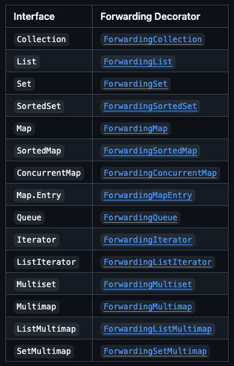

# Favor composition over inheritance

Inheritance, code reuse sağlamak için güçlü bir yoldur, ancak her zaman "job" için en iyi tool değildir. Uygunsuz
kullanıldığında, kırılgan yazılımlara yol açar. Inheritance'ı, subclass ve superclass implementasyonlarının aynı
programcıların kontrolünde olduğu bir package içinde kullanmak güvenlidir. Ayrıca, specifically extension için
tasarlanmış ve belgelenmiş class'ları extending için inheritance kullanmak da güvenlidir. Ancak, package boundaries'leri
aşarak sıradan concrete class'lardan inheritance almak tehlikelidir. Hatırlatma olarak, bu kitap "inheritance"
kelimesini implementation inheritance (bir class'ın başka bir class'ı extend etmesi) anlamında kullanır. Bu maddede
tartışılan problemler, interface inheritance’a (bir class'ın bir interface'i implement etmesi ya da bir interface'in
başka bir interface'i extend etmesi) uygulanmaz.

Method invocation'ın aksine, inheritance encapsulation'ı ihlal eder. Başka bir deyişle, bir subclass düzgün çalışabilmek
için superclass'ının implementation detaylarına bağlıdır. Superclass'ın implementasyonu sürümden sürüme değişebilir ve
değişirse, subclass bozulabilir; üstelik subclass'ın kodu hiç değiştirilmemiş olsa bile. Bunun sonucu olarak,
superclass'ın yazarları onu özellikle genişletilmek üzere tasarlayıp belgelenmedikçe, bir subclass superclass ile
birlikte gelişmek zorundadır.

Concrete için, HashSet kullanan bir programımız olduğunu varsayalım. Programımızın performansını ayarlamak için,
HashSet'e oluşturulduğundan beri kaç element eklendiğini sorgulamamız gerekiyor (bu, bir element çıkarıldığında azalan
mevcut boyutuyla karıştırılmamalıdır). Bu functionality sağlamak için, denenen `(attempted)` element insertion sayısını
tutan ve bu sayıya erişim sağlayan bir metodu export eden bir HashSet varyantı yazıyoruz. HashSet sınıfı, element
ekleyebilen iki metot içerir: `add` ve `addAll`, bu yüzden bu metotların her ikisini de override ediyoruz:

```
// Hatalı - inheritance'ın uygunsuz kullanımı!
public class InstrumentedHashSet<E> extends HashSet<E> {
    // Denenen (attempted) element ekleme sayısı
    private int addCount = 0;

    public InstrumentedHashSet() {
    }

    public InstrumentedHashSet(int initialCapacity, float loadFactor) {
        super(initialCapacity, loadFactor);
    }

    @Override
    public boolean add(E e) {
        addCount++;
        return super.add(e);
    }

    @Override
    public boolean addAll(Collection<? extends E> c) {
        addCount += c.size();
        return super.addAll(c);
    }

    public int getAddCount(){
        return addCount;
    }
}
```

Bu sınıf makul görünüyor, ancak çalışmıyor. Diyelim ki bir instance oluşturup `addAll` metodu kullanarak üç element
ekledik. Bu arada, Java 9'da eklenen static factory metodu `List.of` kullanarak bir liste oluşturduğumuza dikkat edin;
Eğer daha önceki bir sürümü kullanıyorsanız, `Arrays.asList`'i kullanın:

```
InstrumentedHashSet<String> s = new InstrumentedHashSet<>();
s.addAll(List.of("Snap", "Crackle", "Pop"));
System.out.println(s.getAddCount()); // => 6
```

Bu noktada `getAddCount` metodunun üç döndürmesini bekleriz, ancak altı döndürüyor. Ne yanlış gitti? Internally,
`HashSet`'in `addAll` metodu, `add` metodu üzerine inşa edilmiştir; ancak HashSet, oldukça makul bir şekilde, bu
implementasyon detayını belgelememektedir. Instrumented-HashSet'teki `addAll` metodu, `addCount`'a üç ekledi ve ardından
`super.addAll` kullanarak HashSet'in `addAll` implementasyonunu çağırdı. Bu da, her bir element için
`InstrumentedHashSet`'te override edilmiş `add` metodunu çağırdı. Bu üç invocation'ının her biri, `addCount`'a birer
tane daha ekleyerek toplamda `altılık` bir artışa neden oldu: `addAll` metoduyla eklenen her bir element çift sayılır.

Subclass'ın, addAll metodunu override etmesini ortadan kaldırarak "düzeltebiliriz". Ortaya çıkan sınıf çalışsa da,
düzgün çalışması için `HashSet`'in `addAll` metodunun `add` metodu üzerine kurulu olduğu gerçeğine bağımlı olacaktır.
Bu "self-use" bir implementasyon detaydır, Java platformunun tüm implementasyonlarında geçerli olması garanti edilmez ve
sürümden sürüme değişebilir. Bu nedenle, ortaya çıkan InstrumentedHashSet sınıfı kırılgan olacaktır.

`addAll` metodunu, belirtilen collection üzerinde iterate ederek, her bir element için add metodunu bir kez call etmek
üzere override etmek biraz daha iyi olacaktır. Bu durum, HashSet'in addAll metodunun add metodu üzerine kurulu olup
olmadığından bağımsız olarak doğru sonucu garanti ederdi, çünkü HashSet'in addAll implementasyonu artık invoke
edilmezdi. Ancak bu teknik, tüm sorunlarımızı çözmez. Bu durum, `self-use` ile sonuçlanabilecek veya sonuçlanmayabilecek
superclass metotlarını reimplementing etmek anlamına gelir ki bu zor, zaman alıcı, hataya açık ve performansı
düşürebilir. Ek olarak, bu her zaman mümkün değildir çünkü bazı metotlar, subclass'a erişilemeyen private field'lere
erişim olmadan implemente edilemez.

Subclass'larda ki kırılganlığın ilgili bir nedeni, superclass'larının sonraki sürümlerde yeni metotlar edinebilmesidir.
Diyelim ki bir programın güvenliği, bir collection'a eklenen tüm elementlerin belirli bir predicate'i sağlaması
gerçeğine bağlıdır. Bu, collection'ı subclassing ile ve element ekleyebilen her metodu, elementi eklemeden önce
predicate'in karşılandığından emin olmak için override ederek garanti edilebilir. Bu durum, sonraki bir sürümde
superclass'a element ekleyebilen yeni bir metot eklenene kadar sorunsuz çalışır. Bu durum gerçekleştiğinde, subclass'da
override edilmemiş yeni metodu invoke ederek "illegal" bir element eklemek mümkün hale gelir. Bu tamamen teorik bir
problem değildir. `Hashtable` ve `Vector` Collections Framework'e dahil edildiklerinde, bu türden birkaç güvenlik açığı
giderilmek zorunda kalmıştır. Bu problemlerin her ikisi de metotları override etmekten kaynaklanır. Sadece yeni metotlar
ekleyip, mevcut metotları override etmekten kaçınırsanız, bir sınıfı extend etmenin güvenli olduğunu düşünebilirsiniz.
Bu tür bir extension çok daha güvenli olsa da, risksiz değildir. Eğer superclass sonraki bir sürümde yeni bir metot
edinirse ve siz de subclass'da aynı imzaya sahip fakat farklı bir return type'ı olan bir metot verme şanssızlığına
sahipseniz, subclass'ınız artık compile edilmeyecektir `[JLS, 8.4.8.3]`. Eğer subclass'a, yeni superclass'ın metoduyla
aynı imzaya ve return type'ına sahip bir metot verdiyseniz, artık onu override ediyorsunuz demektir, dolayısıyla daha
önce açıklanan sorunlara maruz kalırsınız. Dahası, metodunuzun yeni superclass metodunun contract'ını yerine getireceği
şüphelidir, çünkü subclass metodunu yazdığınızda bu contract henüz yazılmamıştı.

Neyse ki, yukarıda açıklanan tüm sorunlardan kaçınmanın bir yolu var. Mevcut bir sınıfı extend etmek yerine, yeni
sınıfınıza mevcut sınıfın bir instance'ını referans alan private field ekleyin. Bu tasarıma `composition` denir, çünkü
mevcut sınıf, yenisinin bir `component`'i haline gelir. Yeni sınıftaki her instance metodu, mevcut sınıfın içerdiği
instance üzerindeki karşılık gelen metodu invoke eder ve sonuçları döndürür. Bu durum `forwarding` olarak bilinir ve
yeni sınıftaki metotlar da `forwarding methods` olarak adlandırılır. Ortaya çıkan sınıf, mevcut sınıfın implementasyon
detaylarına hiçbir bağımlılığı `(dependencies)` olmayan, kaya gibi sağlam olacaktır. Mevcut sınıfa yeni metotlar eklemek
bile yeni sınıf üzerinde hiçbir etki yaratmayacaktır. Bunu somutlaştırmak gerekirse, `composition-and-forwarding`
yaklaşımını kullanan `InstrumentedHashSet`'e bir alternatif aşağıdadır. Implementation'ın iki parçaya ayrıldığına dikkat
edin: sınıfın kendisi ve tüm forwarding metotlarını içeren, başka hiçbir şey içermeyen yeniden kullanılabilir bir
forwarding sınıfı:

```
// Reusable forwarding class
public class ForwardingSet<E> implements Set<E> {
    private final Set<E> set;

    public ForwardingSet(Set<E> set){
        this.set = set;
    }

    @Override
    public void clear() {
        set.clear();
    }

    @Override
    public boolean contains(Object o) {
        return set.contains(o);
    }

    @Override
    public boolean containsAll(Collection<?> c) {
        return set.containsAll(c);
    }

    @Override
    public boolean isEmpty() {
        return set.isEmpty();
    }

    @Override
    public int size() {
        return set.size();
    }

    @Override
    public Iterator<E> iterator() {
        return set.iterator();
    }

    @Override
    public boolean add(E e) {
        return set.add(e);
    }

    @Override
    public boolean addAll(Collection<? extends E> c) {
        return set.addAll(c);
    }

    @Override
    public boolean remove(Object o) {
        return set.remove(o);
    }

    @Override
    public boolean removeAll(Collection<?> c) {
        return set.removeAll(c);
    }

    @Override
    public boolean retainAll(Collection<?> c) {
        return set.retainAll(c);
    }

    @Override
    public <T> T[] toArray(T[] a) {
        return set.toArray(a);
    }

    @Override
    public Object[] toArray() {
        return set.toArray();
    }

    @Override
    public boolean equals(Object obj) {
        return set.equals(obj);
    }

    @Override
    public int hashCode() {
        return set.hashCode();
    }

    @Override
    public String toString() {
        return "ForwardingSet{" +
                "set=" + set +
                '}';
    }
}
```

InstrumentedHashSet.java;

```
// Wrapper sınıfı - inheritance yerine composition kullanır
public class InstrumentedHashSet<E> extends ForwardingSet<E> {
    private int addCount = 0;

    public InstrumentedHashSet(Set<E> set){
        super(set);
    }

    @Override
    public boolean add(E e) {
        addCount++;
        return super.add(e);
    }

    @Override
    public boolean addAll(Collection<? extends E> c) {
        addCount += c.size();
        return super.addAll(c);
    }

    public int getAddCount(){
        return addCount;
    }
}
```

Derived class;

```
InstrumentedHashSet<String> set = new InstrumentedHashSet<>(new HashSet<>());
set.addAll(List.of("Snap", "Crackle", "Pop"));
System.out.println(set.getAddCount()); // => 3
```

`InstrumentedHashSet` sınıfının tasarımı, `HashSet` sınıfının functionality'sini capture eden `Set` interface'inin
varlığıyla mümkün hale gelmiştir. Sağlam olmasının yanı sıra, bu tasarım son derece esnektir. InstrumentedHashSet
sınıfı, Set interface'ini implemente eder ve tek bir constructor vardır; bu constructor'ın argümanı da Set type'ındadır.
Esasen, sınıf bir Set'i başka bir Set'e transform ederek instrumentation functionality ekler. Inheritance-based
yaklaşımın aksine, ki bu sadece tek bir concrete sınıf için çalışır ve superclass'da ki desteklenen her constructor için
ayrı bir constructor gerektirir, `wrapper` sınıfı herhangi bir `Set` implementasyonunu enstrümante etmek için
kullanılabilir ve önceden var olan herhangi bir constructor ile birlikte çalışacaktır.

```
Set<Instant> times = new InstrumentedHashSet<>(new TreeSet<>(cmp));
Set<E> s = new InstrumentedHashSet<>(new HashSet<>(INIT_CAPACITY));
```

InstrumentedHashSet sınıfı, daha önce enstrümantasyon olmadan kullanılmış bir set instance'ını temporarily enstrümante
etmek için bile kullanılabilir:

```
static void walk(Set<Dog> dogs) {
    InstrumentedHashSet<Dog> iDogs = new InstrumentedHashSet<>(dogs);
    ... // Within this method use iDogs instead of dogs
}
```

InstrumentedHashSet sınıfı bir wrapper sınıfı olarak bilinir çünkü her bir InstrumentedHashSet instance'i, başka bir Set
instance'ini içerir ("wrap eder"). Bu aynı zamanda Decorator pattern olarak da bilinir çünkü InstrumentedHashSet sınıfı,
enstrümantasyon ekleyerek bir set'i "decorate eder". Bazen `composition` ve `forwarding` kombinasyonu, gevşek bir
şekilde delegation olarak adlandırılır. Teknik olarak, wrapper object'i kendisini wrapped object'e geçirmediği sürece
delegation değildir.

Wrapper sınıflarının dezavantajları azdır. Bir uyarı da şudur ki, wrapper class'lar, object'lerin kendilerine ait
referansları sonraki invocation'lar (“callback”ler) için diğer object'lere ilettiği callback framework'lerinde
kullanılmaya uygun değildir. Wrapped bir object, wrapper'ını bilmediği için kendisine `(this)` bir referans geçirir ve
callback'ler wrapper'dan sıyrılır. Bu durum `SELF` problemi olarak bilinir. Bazı kişiler, `forwarding` metot
invoke'larının performans etkisi veya wrapper object'lerinin memory footprint impact'i hakkında endişe duyuyor. Pratikte
ikisinin de pek bir etkisi olmadığı ortaya çıkıyor. Forwarding metotlarını yazmak sıkıcıdır, ancak her interface için
yeniden kullanılabilir forwarding sınıfını yalnızca bir kez yazmanız gerekir ve forwarding sınıfları size sağlanabilir.
Örneğin, Guava, tüm collection interface'leri için forwarding classes sağlar.

> Guava Forwarding Class `https://github.com/google/guava/wiki/CollectionHelpersExplained`

Bazen kendi collection extension'larını yazmanız gerekir. Belki bir list'e elements eklendiğinde special bir behavior
eklemek veya aslında bir database query'si ile desteklenen bir Iterable yazmak istiyorsunuz. Guava bu görevleri sizin ve
bizim için kolaylaştırmak adına bir dizi yardımcı program sağlar. (Sonuçta, collections framework'ünü kendimiz
extend etme işindeyiz.) Tüm çeşitli collection interface'leri için Guava, decorator pattern'ini kullanmayı
kolaylaştırmak amacıyla Forwarding abstract sınıflar sağlar.

Forwarding sınıfları, decorated object'i döndürmek için override etmeniz gereken abstract bir method olan delegate()'i
define eder. Diğer methodların her biri directly delegate'e: Yani, örneğin, `ForwardingList.get(int)` basitçe
`delegate().get(int)` olarak implement edilir.

`ForwardingXXX`'i subclassing yaparak ve `delegate()` methodunu implement ederek, hedeflenen sınıftaki yalnızca seçili
methodları override edebilir, her methodu kendiniz delegate etmek zorunda kalmadan decorated functionality
ekleyebilirsiniz.

Ek olarak, birçok method'un, örneğin `AbstractList` veya JDK'daki diğer skeleton sınıflarını extending ile aynı
faydaları sağlayan, beklenen behavior'ı kurtarmak için kullanabileceğiniz bir `standardMethod` implementation'ı vardır.

Haydi bir örnek yapalım. Diyelim ki bir List'i, kendisine eklenen tüm elements'leri loglayacak şekilde decorate etmek
istediniz. Elbette, elements'leri eklemek için hangi method kullanılırsa kullanılsın - `add(int, E)`, `add(E)` veya
`addAll(Collection)` - hepsini loglamak istiyoruz, bu yüzden bu method'ların hepsini override etmemiz gerekiyor.

```
public class AddLogging<E> extends ForwardingList<E> {
    final List<E> delegate; // backing list

    public AddLogging(List<E> delegate) {
        this.delegate = delegate;
    }

    @Override
    protected List<E> delegate() {
        return delegate;
    }

    @Override
    public void add(int index, E element) {
        System.out.println("logging");
        super.add(index,element);
    }

    @Override
    public boolean add(E element) {
        return standardAdd(element);
    }

    @Override
    public boolean addAll(Collection<? extends E> collection) {
        return standardAddAll(collection);
    }
}
```

Unutmayın, default olarak, tüm method'lar doğrudan delegate'e forward edilir, bu nedenle `ForwardingMap.put`'u override
etmek, `ForwardingMap.putAll`'un behavior'ını değiştirmeyecektir. Behavior'ı değişmesi gereken her method'u override
etmeye dikkat edin ve decorated collection'ınızın contract'ını karşıladığından emin olun.

Genel olarak, AbstractList gibi abstract collection skeleton'ları tarafından sağlanan çoğu method, Forwarding
decorator'larda standard implementation olarak da sağlanır.

Special view'ler sağlayan interface'ler bazen bu view'lerin Standard implementation'larını sağlar. Örneğin,
ForwardingMap, StandardKeySet, StandardValues ve StandardEntrySet sınıflarını sağlar; bunların her biri, method'larını
mümkün olduğunda decorated map'e delegate eder veya aksi takdirde, delegate edilemeyen method'ları abstract bırakır.



### PeekingIterator

Bazen normal Iterator interface'i yeterli değildir. Iterator'lar, bir Iterator'ı wrap eden ve PeekingIterator döndüren
`Iterators.peekingIterator(Iterator)` method'unu destekler. PeekingIterator, `next()`'e bir sonraki call'da döndürülecek
element'e `peek()` yapmanızı sağlayan bir Iterator subtype'ıdır.

Not: `Iterators.peekingIterator` tarafından döndürülen `PeekingIterator`, bir `peek()` işleminden sonra `remove()`
call'larını desteklemez. Haydi bir örnek yapalım: Ardışık duplicated elements'leri eleyerek bir List'i kopyalamak.

```
List<E> result = Lists.newArrayList();
PeekingIterator<E> iter = Iterators.peekingIterator(source.iterator());
while (iter.hasNext()) {
  E current = iter.next();
  while (iter.hasNext() && iter.peek().equals(current)) {
    // skip this duplicate element
    iter.next();
  }
  result.add(current);
}
```

Bunu yapmanın geleneksel yolu, önceki element'i takip etmeyi ve belirli koşullar altında geri dönmeyi içerir, ancak bu
zorlu ve hataya açık bir iştir. PeekingIterator comparatively olarak anlaşılması ve kullanılması kolaydır.

### AbstractIterator

Kendi Iterator'ınızı mı implement ediyorsunuz? AbstractIterator hayatınızı kolaylaştırabilir. Örnekle açıklamak en kolay
yoldur. Diyelim ki null değerleri atlamak için bir iterator'ı wrap etmek istedik.

```
public static Iterator<String> skipNulls(final Iterator<String> in) {
    return new AbstractIterator<String>() {
        @Override
        protected @Nullable String computeNext() {
            while (in.hasNext()) {
                String s = in.next();
                if (s != null) {
                    return s;
                }
            }
            return endOfData();
        }
    };
}
```

Sadece bir method olan `computeNext()`'i implement ediyorsunuz, bu method bir sonraki değeri compute eder. Sequence
bittiğinde, iteration'ın sonunu işaretlemek için `endOfData()`'yı döndürmeniz yeterlidir.

> End of documentation

Inheritance, yalnızca subclass'ın gerçekten superclass'ın bir subtype'ı olduğu durumlarda uygundur. Başka bir deyişle,
bir `B` sınıfı, ancak iki sınıf arasında bir `is-a` ilişkisi varsa bir `A` sınıfını extend etmelidir. Eğer bir `B`
sınıfının bir `A` sınıfını extend etmesini isteme eğilimindeyseniz, kendinize şu soruyu sorun: Her `B` gerçekten bir
`A` mı? Bu soruya evet yanıtını doğru bir şekilde veremiyorsanız, `B`, `A`'yı extend etmemelidir. Cevap hayır ise, çoğu
zaman `B`'nin `A`'nın private bir instance'ini içermesi ve farklı bir API'yi ifşa `(expose)` etmesi gerekir: `A`,
`B`'nin esaslı `(essential)` bir parçası değil, yalnızca implementation'ının bir detayıdır.

Java platform library'lerinde bu ilkenin bir dizi bariz ihlali bulunmaktadır. Örneğin, bir `stack` bir `vector`
değildir, bu yüzden Stack Vector'u extend `etmemelidir`. Benzer şekilde, bir property list bir hash table değildir, bu
yüzden Properties Hashtable'ı extend etmemelidir. Her iki durumda da, `composition` tercih edilebilirdi.

Composition'ın uygun olduğu yerde inheritance kullanırsanız, implementation detaylarını gereksiz yere ifşa `(expose)`
edersiniz. Ortaya çıkan API, sizi orijinal implementation'a bağlar `(tie)` ve sınıfınızın performansını sonsuza dek
sınırlar. Daha da önemlisi, internals'ı ifşa `(expose)` ederek client'ların onlara directly erişmesine izin vermiş
olursunuz. En azından kafa karıştırıcı semantics'e yol açabilir. Örneğin, eğer `p` bir Properties instance'ına atıfta
bulunuyorsa, `p.getProperty(key)`, `p.get(key)`'den farklı sonuçlar verebilir: İlk method default'ları hesaba katar,
oysa Hashtable'dan inherited ikinci method bunu yapmaz. En ciddi olarak, client, superclass'ı doğrudan değiştirerek
subclass'ın değişmezlerini `(invariants)` bozabilir. Properties örneğinde, tasarımcılar yalnızca string'lerin key ve
value olarak kullanılmasına izin vermiştir, ancak temel alınan Hashtable'a direct access bu değişmezin `(invariant)`
ihlal edilmesine olanak tanır. Bir kez ihlal edildiğinde, Properties API'sinin diğer bölümlerini `(load ve store)`
kullanmak artık mümkün olmaz. Bu problem keşfedildiğinde, client'lar string olmayan key ve value kullanımlarına bağımlı
hâle geldiğinden düzeltmek için artık çok geçti.

Composition yerine inheritance kullanmaya karar vermeden önce kendinize sormanız gereken son bir dizi soru daha vardır.
Extend etmeyi düşündüğünüz class'ın API'sinde herhangi bir kusur var mı? Eğer varsa, bu kusurları kendi class'ınızın
API'sine yansıtmakta rahat mısınız? Inheritance, superclass'ın API'sindeki tüm kusurları yayar, oysa composition bu
kusurları gizleyen yeni bir API tasarlamanıza olanak tanır.

Özetle, inheritance güçlüdür, ancak encapsulation'ı ihlal ettiği için problemlidir. Yalnızca subclass ile superclass
arasında gerçek bir subtype ilişkisi bulunduğunda uygundur. Yine de, subclass superclass'tan farklı bir package'de ise
ve superclass inheritance için tasarlanmamışsa, inheritance kırılganlığa yol açabilir. Bu kırılganlığı önlemek için,
özellikle bir wrapper class implement etmek için uygun bir interface mevcutsa, inheritance yerine composition ve
forwarding kullanın. Yalnızca wrapper class'lar subclass'lardan daha sağlam olmakla kalmaz, aynı zamanda daha
güçlüdürler.