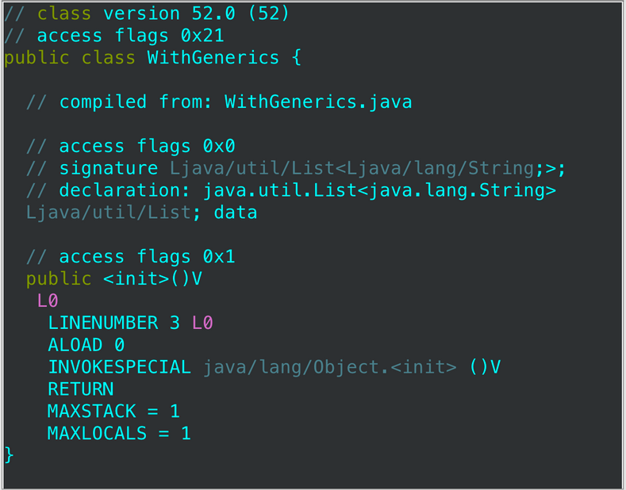
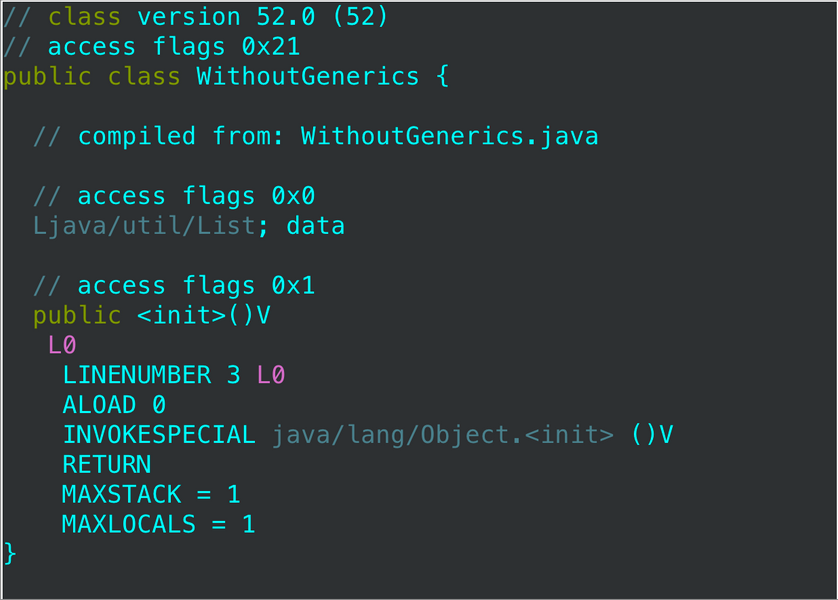

# Consider typesafe heterogeneous containers

Generics'in yaygın kullanımları arasında `Set<E>` ve `Map<K,V>` gibi collection'lar ve `ThreadLocal<T>` ile
`AtomicReference<T>` gibi tek elementli container'lar bulunur. Tüm bu kullanımlarda, parameterized olan container'dır.
Bu, container başına fixed sayıda type parameter ile sınırlı olmanızı sağlar. Genellikle, bu tam olarak istediğiniz
şeydir. Bir `Set`, element type'ını represent eden tek bir type parameter'a sahiptir; bir Map ise key ve value
type'larını represent eden iki tane type parameter'a sahiptir; ve benzeri.

Ancak bazen, daha fazla esnekliğe ihtiyaç duyarsınız. Örneğin, bir database row'u keyfi sayıda column'a sahip olabilir
ve bunların tümüne typesafe şekilde erişebilmek güzel olur. Neyse ki, bu etkiyi elde etmek için kolay bir yol vardır.
Fikir, container yerine key'i parameterize etmektir. Sonra, parameterize edilmiş key'i bir value'yu eklemek veya almak
için container'a sunarsınız. Generic type sistemi, value'nun type'ının key ile uyumlu olduğunu garanti etmek için
kullanılır.

Bu yaklaşımın basit bir örneği olarak, client'larının keyfi sayıda türden favori bir instance'ı saklamasına ve almasına
izin veren bir `Favorites` sınıfını düşünün. Type için Class object'i , parameterize edilmiş key rolünü üstlenecektir.
Bunun işe yaramasının sebebi, Class sınıfının generic olmasıdır. Bir class literal'in tipi sadece Class değil,
`Class<T>`'dir. Örneğin, `String.class` tipi `Class<String>` ve `Integer.class` tipi `Class<Integer>`’dır.

Bir class literal, hem compile-time hem de runtime type bilgisini iletmek için methodlar arasında pass edildiğinde, buna
type token denir.

> Type Token (https://helw.net/2017/11/09/runtime-generics-in-an-erasure-world/)

Zaten bildiğimiz gibi, Java’daki generics, type safety’yi sağlamak için compile time’da çalışan bir kavramdır. Compile
sırasında type erasure devreye girer ve bunun sonucunda oluşan bytecode, herhangi bir generics bilgisinden arındırılmış
olur. Ancak bazen, runtime'da generics bilgisine ihtiyaç duyarız (örneğin, bir JSON string'ini object formuna
dönüştürmemiz gerektiğinde). Type'lar compile time'da silindiğine `(erased)` göre bu nasıl çalışıyor diye merak
ediyordum? başka bir deyişle, gson’un TypeToken sınıfı nasıl çalışıyor?

Başka bir deyişle, generics runtime’da olmadığında (özellikle String yerine, object type'ı custom bir data object
olduğunda) bu nasıl çalışır?

Öncelikle Gson library'sini ekliyorum;

```
google.code.gson
```

```
final Type typeToken = new TypeToken<List<String>>(){}.getType();
final String json = "[\"one\", \"two\"]";
final List<String> items = new Gson().fromJson(json, typeToken);
```

Özetle, java language spec parameterized type’lerin, nested type’ların, array type’ların ve type variable’ların erased
type’ının ne olduğunu belirtir. Daha sonra “her diğer type’ın erasure’ı type’ın kendisidir.” der. TypeToken bu gerçeği
generics bilgisini korumak için kullanır. TypeToken class’ının javadoc’unda belirtildiği gibi: Bu sınıfın bir
subclass'ını oluşturmaya zorlar; bu, type bilgisinin runtime’da bile alınmasını sağlar.

Type erasure’ın bytecode üzerindeki etkilerini doğrudan görmek oldukça etkileyici. Bu iki sınıfa bakalım:

```
class WithGenerics{
    List<String> data;
}

class WithoutGenerics{
    List data;
}
```





Eğer bunları javac ile compile edip ardından bytecode’a bakarsak (javap -v kullanarak), şunu göreceğiz: Dikkat edin,
bytecode her iki sınıf için tamamen aynıdır. Tek istisna, type bilgisinin WithGenerics sınıfının imzasında bulunmasıdır.
Eğer `javap -v` çalıştırırsak, bu imzanın type’ın aslında bulunduğu constant pool’a referans verdiğini görürüz.

```
{
    java.util.List<java.lang.String> data;
    descriptor: Ljava/util/List;
    Signature: #7    // Ljava/util/List<Ljava/lang/String;>;
}
```

Buna karşılık, WithoutGenerics’e baktığımızda şunu görürüz:

```
{
    java.util.List data;
    descriptor: Ljava/util/List;
}
```

Başka bir örneğe daha bakalım;

```
class InnerType{
    public static class Internal<T>{}

    public static void main(String[] args) {
    }
}
```

Javac çalıştırıldıktan sonra iki sınıf elde ederiz - `InnerType.class` ve `InnerType$Internal.class`.
`InnerType$Internal.class`’a javap -v ile bakıldığında, sınıf şu şekilde tanımlanmıştır:

```
public class InnerType$Internal<T extends java.lang.Object> extends java.lang.Object
```

Sınıf bilgilerini şöyle görüntülemeye çalışırsak:

```
public class InnerType {
    public static class Internal<T>{}

    public static void main(String[] args) {
        Internal<String> internal = new Internal<>();
        Class<?> classType = internal.getClass();
        System.out.println(classType + ", " + classType.getGenericSuperclass());
        // => class InnerType$Internal, class java.lang.Object
    }
}
```

`InnerType$Internal` elde ederiz, superclass’i `java.lang.Object` olarak. Şimdi örneği biraz değiştirip, Internal’ın
anonymous bir subclass'ını şu şekilde oluşturalım:

```
Internal<String> internal = new Internal<String>(){
   /* İstersek burada method’ları override edebiliriz. */
};
```

Sadece bu değişikliği yaparak, uygulama artık sınıfın `InnerType$1` olduğunu ve generic superclass’ının
`InnerType.InnerType$Internal<java.lang.String>` olduğunu yazar. Bu generic superclass aslında bir parameterized
type’tır, bu yüzden onu cast edip aşağıdaki gibi ekstra bilgi çıkarabiliriz:

```
ParameterizedType t = (ParameterizedType) classType.getGenericSuperclass();
System.out.println(t.getOwnerType() + ", " + t.getRawType() + ", " +
   Arrays.toString(t.getActualTypeArguments()));
```

Bunu çalıştırdığımızda artık bir owner type olarak `InnerType`, bir raw type olarak `InnerType$Internal` ve actual type
argument’ları olarak `java.lang.String` elde ederiz. İlk Gson örneğine geri dönersek, Gson tarafından sağlanan bir
TypeToken class’ının kullanıldığını görürüz. Bu class ne yapar?

Burada iki class bizim için önemlidir: `TypeToken` ve `$Gson$Types`. TypeToken constructor’ına baktığımızda, üç şey
yaptığını görebiliriz:

* type üzerinde bir canonicalize method’u çağırır.

* raw type’ı alır.

* bir hashcode hesaplar.

En önemlisi, canonicalize method’u `$Gson$Types` içinde bulunur ve verilen actual Type’a bağlı olarak özel bir Type
döner — örneğin, eğer bu bir array ise, bir `GenericArrayTypeImpl` oluşturulur. Yukarıdaki örnekte, owner type, raw type
ve actual argument’leri kullanarak bir ParameterizedTypeImpl oluşturulur. Bu case de, Gson’un api caller'ları olarak,
generic type parametrelerimizle yeni bir TypeToken oluştururuz. İçeride, bu, Gson içinde deserialization sırasında doğru
işlemi yapabilmek için kullanılabilecek bir ParameterizedTypeImpl oluşturur.

> End of documentation

Favorites class’ının API’si basittir. Map yerine key'in parametrelendirilmesi dışında basit bir map gibi görünür.
Client, favorileri ayarlarken ve alırken bir Class object sunar. İşte API:

```
// Typesafe heterogeneous container pattern - API
class Favorites {
    private Map<Class<?>, Object> favorites = new HashMap<>();

    public <T> void putFavorite(Class<T> type, T instance) {
        favorites.put(Objects.requireNonNull(type), instance);
    }

    public <T> T getFavorite(Class<T> type) {
        return type.cast(favorites.get(type));
    }
}
```

İşte Favorites class’ını kullanan örnek bir program, favori `String`, `Integer` ve `Class` instance’larını saklayıp,
alıp ve yazdırıyor:

```
public static void main(String[] args) {
    // Typesafe heterogeneous container pattern - client
    Favorites f = new Favorites();

    f.putFavorite(String.class, "Java");
    String stringFavorite = f.getFavorite(String.class);

    f.putFavorite(Integer.class, 0xcafebabe);
    Integer integerFavorite = f.getFavorite(Integer.class);

    f.putFavorite(Class.class, Favorites.class);
    Class<?> classFavorite = f.getFavorite(Class.class);

    System.out.printf("%s %x %s%n", stringFavorite, integerFavorite, classFavorite.getName());
    // => Java cafebabe Favorites
}
```

Beklendiği gibi, bu program `Java cafebabe Favorites` yazdırır. Bu arada, Java’nın printf methodu C’den farklıdır; C’de
`\n` kullanmanız gereken yerde `%n` kullanmalısınız. `%n`, birçok ama tüm platformlarda olmayan, platforma özgü satır
ayırıcıyı oluşturur, bu da çoğu yerde `\n`’dir.

Bir Favorites instance typesafe’dir: Bir String istediğinizde asla Integer döndürmez. Ayrıca heterogeneous’dir: sıradan
bir map’in aksine, tüm key’ler farklı türdendir. Bu nedenle, Favorites’a `typesafe heterogeneous container` diyoruz.
Favorites’ın implementasyonu şaşırtıcı derecede küçüktür. Burada birkaç ince detay var. Her Favorites instance’ı,
`favorites` adlı `private Map<Class<?>, Object>` tarafından desteklenir. Bu Map’e `unbounded wildcard type` nedeniyle
hiçbir şey koyamayacağınızı düşünebilirsiniz, ancak gerçek tam tersidir. Dikkat edilmesi gereken şey wildcard type’ın
`nested` olmasıdır: Wildcard type olan map’in type'ı değil, key’in type'ıdır. Bu, her key’in farklı bir parameterized
type’a sahip olabileceği anlamına gelir: Biri `Class<String>`, diğeri `Class<Integer>` olabilir, ve devam eder.
`Heterogeneity` buradan gelir.

Bir sonraki dikkat edilmesi gereken şey, favorites Map’in value type'ının basitçe `Object` olmasıdır. Başka bir deyişle,
Map, key’ler ile value’lar arasındaki type ilişkisini garanti etmez; bu ilişki, her value’nun key’i tarafından represent
edilen type'da olmasıdır. Aslında, Java’nın type system’i bunu ifade etmek için yeterince güçlü değildir. Ama bunun
doğru olduğunu biliyoruz ve `favorite` alınacağı `(retrieve)` zaman bundan faydalanıyoruz. `putFavorite` implementasyonu
basittir: Basitçe verilen Class object'inden verilen `favorite` instance'ına bir `mapping` koyar. Belirtildiği gibi, bu
key ile value arasındaki “type linkage”i discard eder; value’nun key’in bir instance’ı olduğu bilgisini kaybeder. Ama
sorun değil, çünkü getFavorites methodu bu bağlantıyı `(linkage)` yeniden kurabilir ve kurar. `getFavorite`
implementasyonu, `putFavorite`’dan daha karmaşıktır. İlk olarak, verilen Class object’e karşılık gelen değeri favorites
map’inden alır. Bu, döndürülmesi gereken doğru object referansıdır, ancak yanlış compile-time type’a sahiptir:
Object’tir (favorites map’in value türü) ve biz `T` döndürmemiz gerekir. Bu nedenle, `getFavorite` implementasyonu
Class’ın cast methodunu kullanarak object referansını Class object tarafından represent edilen type'a dynamic olarak
cast eder.

Cast methodu, Java’nın cast operatörünün dynamic benzeridir. Sadece argümanının Class object tarafından represent edilen
type'ın bir instance’ı olup olmadığını kontrol eder. Eğer öyleyse, argümanı döndürür; aksi halde `ClassCastException`
fırlatır. Client kodu sorunsuz compile edildiği sürece, `getFavorite` içindeki cast invocation’ın ClassCastException
fırlatmayacağını biliyoruz. Yani, favorites map’teki value'ların her zaman key’lerinin type'ları ile match olduğunu
biliyoruz.

Peki, cast methodu bize ne yapıyor, sadece argümanını döndürdüğü halde? Cast methodunun imzası, Class sınıfının generic
olmasının tüm avantajını kullanır. Return type, Class object’in type parameter’ıdır:

```
public class Class<T> {
    T cast(Object obj);
}
```

Bu, getFavorite methodunun tam olarak ihtiyaç duyduğu şeydir. Bu, unchecked cast yapmadan Favorites’ı typesafe yapmamızı
sağlar.

Favorites class’ının dikkat edilmesi gereken iki sınırlaması vardır. İlk olarak, kötü niyetli bir client, Class object’i
raw formda kullanarak bir Favorites instance’ının type safety’sini kolayca bozabilir. Ama ortaya çıkan client kodu
compile edilirken unchecked uyarısı oluşturur. Bu, HashSet ve HashMap gibi normal collection implementasyonlarından
farklı değildir. Raw type HashSet kullanarak kolayca `HashSet<Integer>`’e bir String koyabilirsiniz (Item 26). Bununla
birlikte, bunun için ödeme yapmaya istekliyseniz runtime type safety elde edebilirsiniz. Favorites’ın type invariant’ını
asla ihlal etmemesini sağlamak için putFavorite methodunun instance’ın gerçekten type tarafından represent edilen
type'ın bir instance’ı olduğunu kontrol etmesi gerekir, ve bunu nasıl yapacağımızı zaten biliyoruz. Dynamic cast
kullanın:

```
// Dynamic cast ile runtime type safety sağlama
public <T> void putFavorite(Class<T> type, T instance) {
    favorites.put(type, type.cast(instance));
}
```

`java.util.Collections` içinde aynı numarayı yapan collection wrapper’lar vardır. Bunlar `checkedSet`, `checkedList`,
`checkedMap` vb. olarak adlandırılır. Static factory'leri, bir collection'a (veya map'e) ek olarak bir Class object'i
(veya iki tane) alır. Static factory’ler generic method’lardır ve Class object ile collection’ın compile-time
type’larının match olmasını sağlar. Wrapper’lar, wrap ettikleri collection’lara `reification` ekler. Örneğin, biri
`Collection<Stamp>`’inize bir `Coin` koymaya çalışırsa, wrapper runtime’da `ClassCastException` fırlatır. Bu
wrapper’lar, generic ve raw type’ları mix eden bir uygulamada, bir collection’a yanlış type'da element ekleyen client
kodunu izlemek için faydalıdır.

Favorites class’ının ikinci sınırlaması, `non-reifiable` type üzerinde kullanılamamasıdır (Item 28). Başka bir deyişle,
`favorite String` veya `String[]` saklayabilirsiniz, ancak `favorite List<String>` saklayamazsınız. favorite
`List<String>` saklamaya çalışırsanız, programınız compile edilmez. Bunun nedeni, `List<String>` için bir Class object
alamamanızdır. `List<String>.class` class literal’ı bir syntax error’dur ve bu aslında iyi bir şeydir. `List<String>` ve
`List<Integer>` tek bir Class object’i paylaşır, bu da `List.class`’tır. “Type literals” `List<String>.class` ve
`List<Integer>.class` legal ve aynı object referansını döndürseydi, Favorites object'inin internal'ında büyük sorunlar
yaşanırdı. Bu sınırlama için tamamen tatmin edici bir çözüm yoktur.

Favorites tarafından kullanılan `type token`’lar unbounded’dır: getFavorite ve putFavorite herhangi bir Class object
kabul eder. Bazen bir metoda geçilebilecek type'ları sınırlandırmanız gerekebilir. Bu, bounded type parameter (Item 30)
veya bounded wildcard (Item 31) kullanarak hangi type'ın represent edilebileceğine sınır koyan bounded type token ile
sağlanabilir.

Annotations API (Item 39) geniş ölçüde bounded type token’ları kullanır. Örneğin, işte bir annotation’ı runtime’da
okumak için method. Bu method, class'ları, method’ları, field'leri ve diğer program elementlerini represent eden
reflective type'lar tarafından implement edilen `AnnotatedElement` interface’inden gelir:

```
public <T extends Annotation>
T getAnnotation(Class<T> annotationType);
```

Parametre olan annotationType, bir annotation type'ını represent eden `bounded type token`’dır. Method, element’in o
type'da ki annotation’ını döner, varsa; yoksa `null` döner. Özünde, annotated element, key’leri annotation türleri olan
typesafe heterogeneous container’dır.

Diyelim ki Class<`?`> type'ında bir object'iniz var ve bunu `getAnnotation` gibi bounded type token gerektiren bir
metoda geçirmek istiyorsunuz. Object'i `Class<? extends Annotation>` olarak cast edebilirsiniz, ancak bu cast
unchecked’tir ve compile time'da warning oluşturur (Item 27). Neyse ki, Class sınıfı bu tür cast’i güvenli (ve dynamic)
şekilde yapan bir instance method sağlar. Bu method `asSubclass` olarak adlandırılır ve çağrıldığı Class object’ini,
argümanının represent ettiği sınıfın bir subclass'ını represent edecek şekilde cast eder. Cast başarılı olursa, method
argümanını döner; başarısız olursa `ClassCastException` fırlatır. İşte compile time'da type'ı bilinmeyen bir
annotation’ı okumak için `asSubclass` methodunu kullanma şekli. Bu method, hata veya uyarı olmadan compile edilir:

```
// AsSubclass kullanarak bounded type token’a güvenli cast yapma
static Annotation getAnnotation(AnnotatedElement element, String annotationTypeName) {
    Class<?> annotationType = null; // Unbounded type token
    try {
        annotationType = Class.forName(annotationTypeName);
    } catch (Exception ex) {
        throw new IllegalArgumentException(ex);
    }
    return element.getAnnotation(
    annotationType.asSubclass(Annotation.class));
}
```

Özetle, collections API’leriyle örneklenen `(exemplified)` generics’in normal kullanımı, her container için sabit sayıda
type parameter ile sınırlıdır. Bu kısıtlamayı, type parameter’ı container yerine key’e koyarak aşabilirsiniz. Bu tür
typesafe heterogeneous container’lar için key olarak Class object’leri kullanabilirsiniz. Bu şekilde kullanılan bir
Class object, type token olarak adlandırılır. Ayrıca özel bir key türü de kullanabilirsiniz. Örneğin, bir DatabaseRow
type'ı database row'unu (container olarak) represent eder ve generic tür `Column<T>` key olarak kullanılır.